# Integrating Turbo with Envizi via webMethods for Green IT data

This blog explains about the step-by-step instructions to pull green IT data from Turbonomic into Envizi via webMethods Integration.


#### Authors
 [Jeya Gandhi Rajan M](https://community.ibm.com/community/user/envirintel/people/jeya-gandhi-rajan-m1) <br />
 [Madhukrishna Parike]() <br />
 [Jyoti Rani]() <br />
 [Indira Kalagara]()

## Contents

- [1. Prerequisite](#1-Prerequisite)
- [2. Architecture](#2-Architecture)
- [3. Create Workflow in webMethods](#3-Create-Workflow-in-webMethods)
- [4. Execute the Workflow](#4-Execute-the-Workflow)
- [5. Check the result in Envizi](#5-Check-the-result-in-Envizi)
- [6. Schedule Workflow Executionn](#6-Schedule-Workflow-Execution)

## 1. Prerequisite

<details><summary>CLICK me for detailed instructions</summary>

### 1.1 Environment

- Turbonomic v8.14.3 or higher 
- Envizi Saas instance access (Click [here](https://techzone.ibm.com/collection/aiapps-environmental-intelligencewith-envizi/environments) to get access). 
- webMethods SaaS (Click [here](https://signup.softwareag.cloud/#/basic-b) to signup for Trial).

### 1.2 Turbonomic Pre-Configuration

1. Create an user with `Observer` role in Turbonomic. Refer [here](#user-content-1-create-user-in-turbonomoic) to create the user.


### 1.3 Envizi Pre Configuration

#### 1.3.1 Organization, Account Style and Location

We would be retreiving Datacenters and its energy consumption (electricity) data from Turbonomic through the Turbonomic APIs.

For each Datacenter in Turbonomic there will be an `Account` created in Envizi under a pre-configured `Location`.

The entire organization hierarchy with Groups, Locations and Accounts in Envizi may look like this. Look at the location and account highlighted in the image below.
| Location       | Account                   |
| ---------- | ----------------------- | 
| IN Bank-ODC-IBMCloud| IN Bank-ODC-IBMCloud-electricity|
| IN Bank-ODC-vc01dc01| IN Bank-ODC-vc01dc01-electricity|


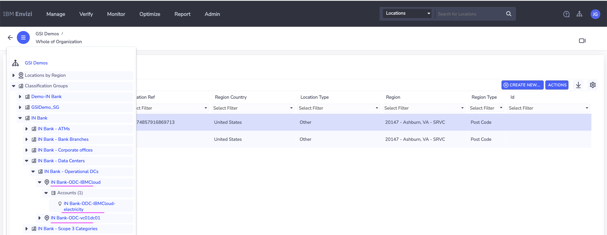

1. Get the values for the below fields from Envizi
  - Organization (Organization name)
  - Organization Link (Organization reference id)
  - Account Style Link (Reference id for the account style `S2 - Electricity - kWh`)
  - Locations Names and Accounts Names (The locations names under which the accounts to be created)

#### 1.3.2 Envizi S3 Bucket

Envizi S3 bucket details are needed to push the data into Envizi. If the S3 is not created in Envizi, refer Steps 1 and 2 [here](https://developer.ibm.com/tutorials/awb-sending-udc-excel-to-s3/) to create it in Envizi.

1. From Envizi S3 bucket screen, get the values for the below fields.
  - Bucket
  - Folder
  - Username
  - Access Key
  - Secret Access Key

</details>

## 2. Architecture

Here is the architecture  that describes about this Turbonomic and Envizi integration via webMethods.

webMethods Integration flow pulls the list of Cloud Regions and On-prem Data Centers from Turbonomic and sends it to Envizi's S3 bucket in a CSV file. This CSV file will be further processed by the Envizi internally.


## 3. Create Workflow in webMethods

Let's create workflow in webMethods.

In this workflow, we will invoke Turbonomic APIs to fetch Energy consumption for each DataCenter locations and transform the JSON API response into the CSV template loaded by Envizi.

### 3.1. Create Project

<details><summary>CLICK me for detailed instructions</summary>

1. Login to your instance of webMethods integration with the respective credentials.

2. Click on `+` under the `Projects` tab.

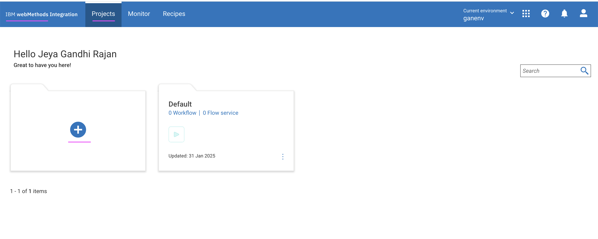

3. Enter the Project name.

4. Click on `Create`, to create the project.

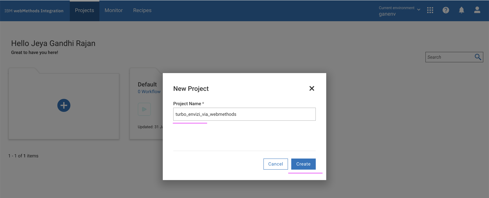

The project gets created as shown in the below image.

</details>

### 3.2. Import Workflow

<details><summary>CLICK me for detailed instructions</summary>

1. Download the Workflow archive file [here](./files/webMethods-archives).

2. Click on `Import` button.

3. Select the Workflow file that is downloaded in the above step.

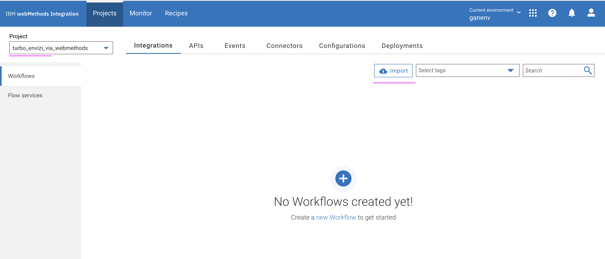

4. Enter the values for the following fields.
  - Workflow Name
  - Workflow Description
  - Parameters

Refer the below table for the parameters values.

| Name       | Value                   | Comments             |
| ---------- | ----------------------- | --------------------
| TurboLoginAPI| https://[Turbonomic-URL]/api/v3/login | Turbonomic Login API. Replace the `[Turbonomic-URL]` with your Turbonomic instance url |
| TurboAccountStatsAPI| https://[Turbonomic-URL]/api/v3/entities/ | Retrieves the Data Centres statistics such as electricity consumption. Replace the `[Turbonomic-URL]` with your Turbonomic instance url |
| TurboDataCentresAPI|https://[Turbonomic-URL]/api/v3/search|  Fetches the data centres locations from Turbomic instance. Replace the `[Turbonomic-URL]` with your Turbonomic instance url |
| TurboUserName||Enter the Turbonomic UserName received as part of Pre-Requisite|
| TurboPassword | | Enter the Turbonomic Password received as part of Pre-Requisite|
| S3BucketName| | S3 Bucket name received as part of Pre-Requisite|
| EnviziTemplateFileName |  | S3 Folder name and File name as as part of Pre-Requisite. Example: client_7e87560fc4e648/Account_Setup_and_Data_Load_DataCenter_electricity.csv|
| statsFilter| See below | The statDate and endDate to retrieve the electricity consumption for the period.|
| EnviziDCMap | See below | Mapping of Data Centre from Turbo to the location and accounts of Envizi|

**statsFilter**
```
{
    "data": {
        "startDate": "2024-01-01 00:00:05",
        "endDate": "2024-12-31 23:59:59",
        "statistics": [
            {
                "name": "Energy",
                "filters": [
                    {
                        "type": "relation",
                        "value": "sold"
                    }
                ]
            }
        ]
    }
}
```
**EnviziDCMap**
```
{
  "data":  [
      {
        "turbo_data_center": "IBMCloud",
        "envizi_location": "IN Bank-ODC-IBMCloud",
        "envizi_account": "IN Bank-ODC-IBMCloud-electricity"
      }, 
      {
        "turbo_data_center": "vc01dc01",
        "envizi_location": "IN Bank-ODC-vc01dc01",
        "envizi_account": "IN Bank-ODC-vc01dc01-electricity"
      }
     
    ]
}
```


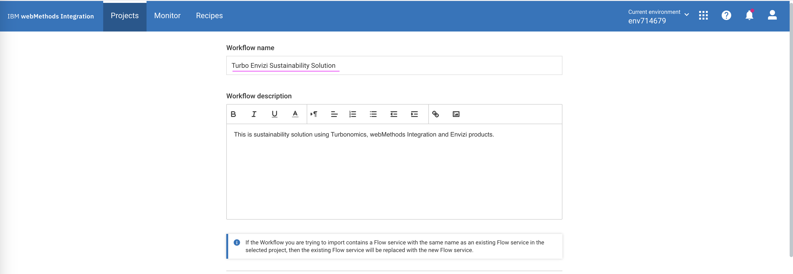
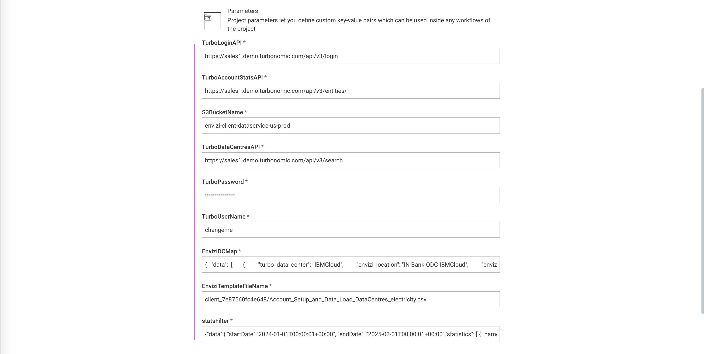
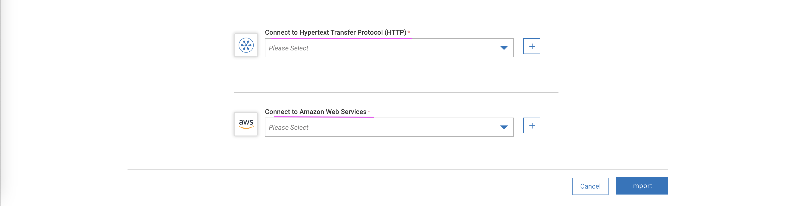


5. In the above page, click on `+` symbol on the `Connect to Hypertext Transfer Protocol (HTTP)` field. 

  The Add Account popup appears as below.

6. In the `URL` field, enter the value `https://[Turbonomic-URL]/api/v3/entities/stats`

7. Click `Add` button.

  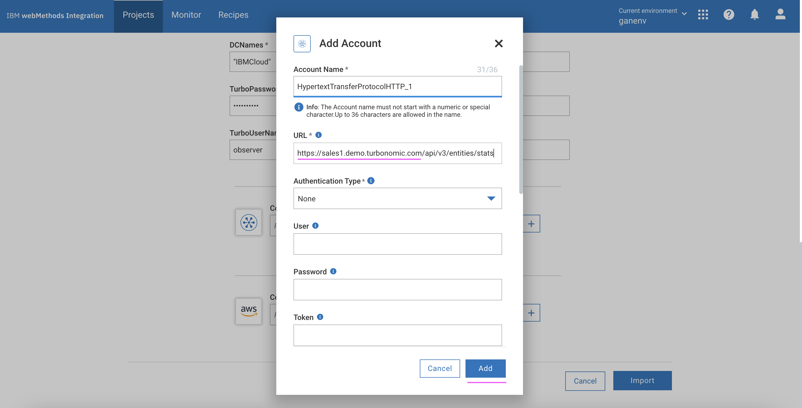

  The project page updated with the above created value.

8. Click on `+` symbol on the `Connect to Amazon Web Services` field. 

  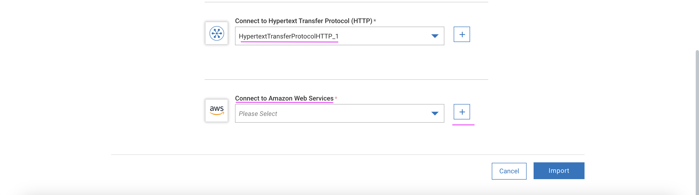

  The Add Account popup appears as below.

9. Enter the following values based on the pre-requisite values from Envizi.

 - Access Key ID
 - Secret Access Key
 - Default Region  (us-east-1)

10. Click `Add` button.

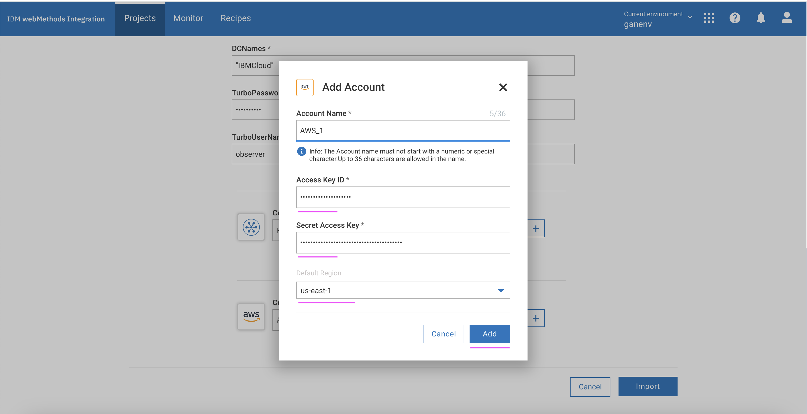

The project page updated with the above created value.

11. Click `Import` button.

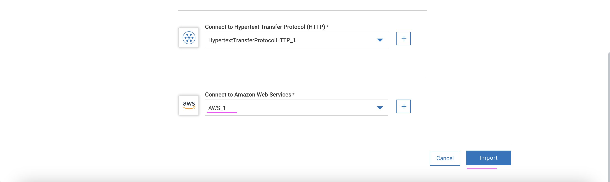

The workflow is created as shown below.

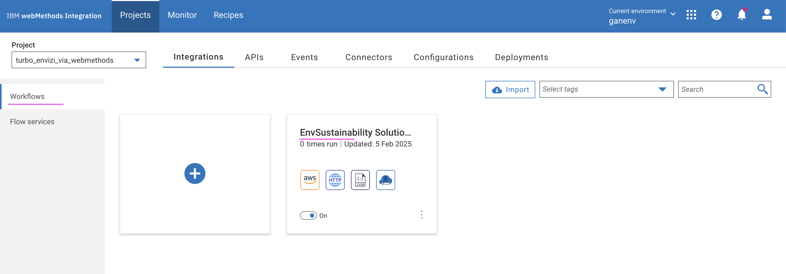

</details>

### 3.3. Create Reference Data

<details><summary>CLICK me for detailed instructions</summary>

#### 3.3.1 Prepare Envizi Template file.

The Envizi template file to be imported into the workflow as a reference data. Let's prepare that.

1. Download the Reference data file from [here](./files/envizi)

2. Update the file with the values based on the below table. But you may need to update the below columns only based on the pre-requisite values from Envizi.
- Organization Link
- Organization
- Account Style Link


|Name                     |  Value               |Comments                  |
|-------------------------|----------------------|--------------------------|
|Organization Link|17000252| The refernce id for the Envizi Organization. Get it from Pre-requisite|
|Organization|GSI Demos	| The name of the Organization. Get it from Pre-requisite|
|Location|IBMCloud| The name of location where the account exists/to be created. It will be updated by webmethods|
|Location Ref| | Leave it empty|
|Account Style Link|14445| The refernce id for the `S2 - Electricity - kWh` account style. Get it from Pre-requisite|
|Account Style Caption|S2 - Electricity - kWh| The account style of this account.  It will be updated by webmethods|
|Account Subtype|Default| Leave it as it is.|
|Account Number|vc01dc01-electricity| The account name. It will be updated by webmethods |
|Account Reference|| Leave it empty|
|Account Supplier|| Leave it empty|
|Account Reader|| Leave it empty|
|Record Start YYYY-MM-DD|02-10-2024| It will be updated by webmethods|
|Record End YYYY-MM-DD|30-12-2024| It will be updated by webmethods |
|Record Data Quality|Actual| Leave it as it is. |
|Record Billing Type|Standard| Leave it as it is. |
|Record Subtype|Default| Leave it as it is. |
|Record Entry Method|Overwrite| Leave it as it is. s|
|Record Reference|| Leave it empty|
|Record Invoice Number|| Leave it empty|
|Total Electricity (kWh)|883.799| Electricity consumption value. It will be updated by webmethods |
|Green Power (kWh)||Leave it empty |
|Total Cost|| Leave it empty|


#### 3.3.2 Add Reference Data

1. Goto the `Reference Data` data page by clicking on `Configurations -> Flow service -> Reference data`

2. Click on `Add Reference data` button.

  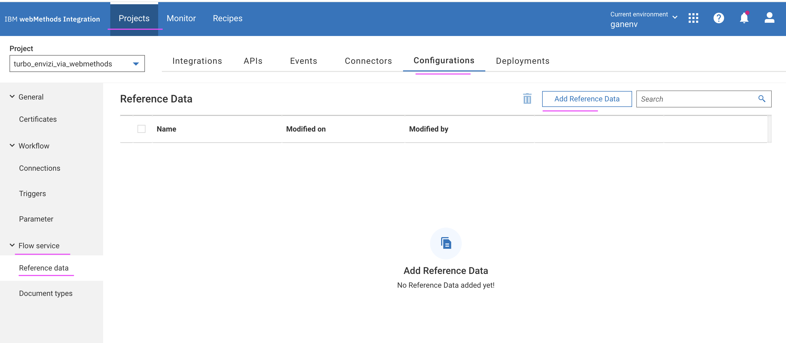

3. In `Save As` column, enter  the value `EnviziTemplate`

  The `Browse file` button is enabled.

4. Click on `Browse file` button.

5. Choose the above prepared `EnviziTemplate.txt` file

  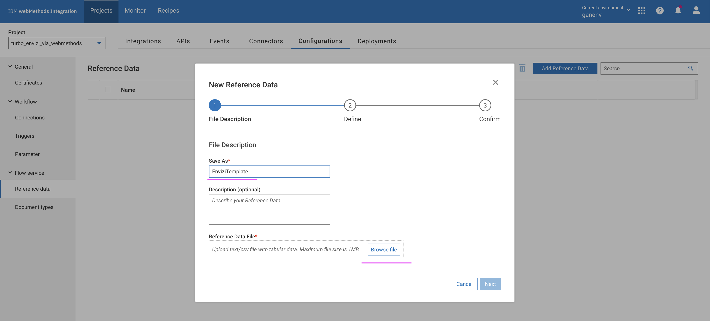

  The selected file appear like this.

6. Click on `Next` button.

  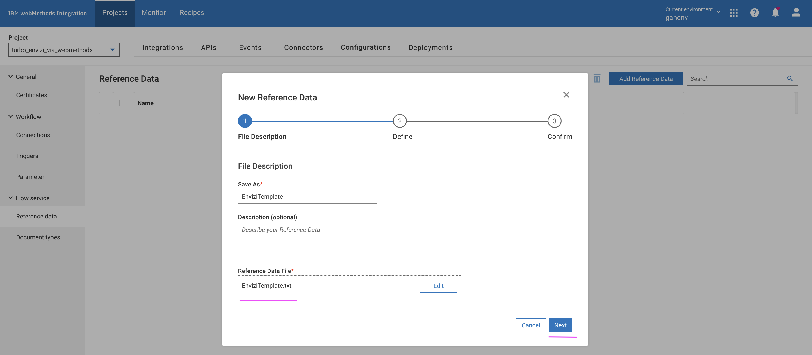

7. Click on `Next` button.

  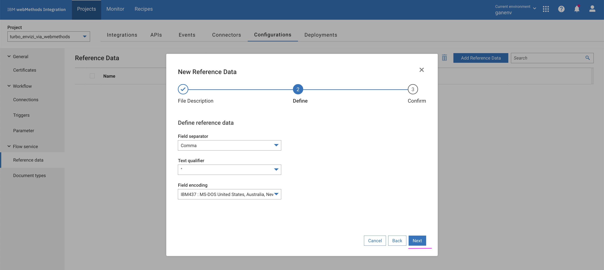

8. Click on `Done` button.

  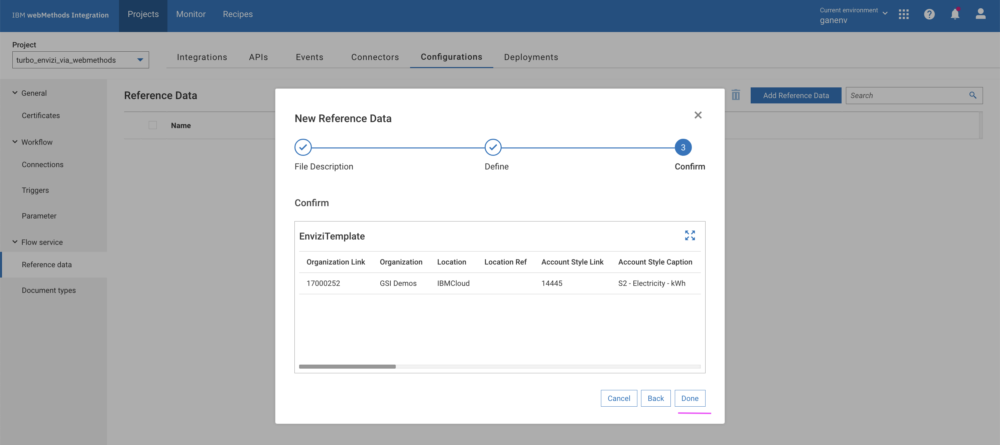

  The reference data is created as shown below.

  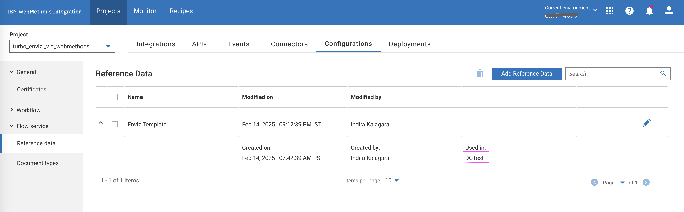

</details>

### 3.4. View the workflow

<details><summary>CLICK me for detailed instructions</summary>

Let's view the imported/created workflow.

1. Click on the `Edit` button in the workflow.

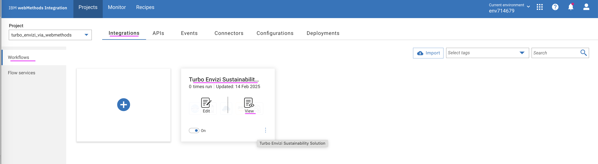

The workflow page is displayed.

Here is the details about the various nodes.

- **Turbonomic API Login** :  This makes an API call to Turbonomic instance login API which returns `set-cookie` and used to authrize the subsequent API calls.
- **DataCentre Retrieve** : It invokes an API call to Turbonomic instance which returns array list of DataCentre’s.
- **JSON Parse** : It formats statsFilter raw JSON data.
- **Query JSON** : It retrieve JSON data from previous node.
- **Query JSON** : It queries the responseObject JSON data from `DataCentre Retrieve`.
- **DCTest** :  It is a flow-service which invokes the Turbonomic stats API to retrieve the electricity consumption and perform the data transformations as needed by Envizi.
- **JSON to CSV** : This converts JSON data from flowservice into a CSV file.
- **S3 Upload File** :  This node uploads the CSV file from previous node into S3 bucket from which Envizi loads into dashboard.

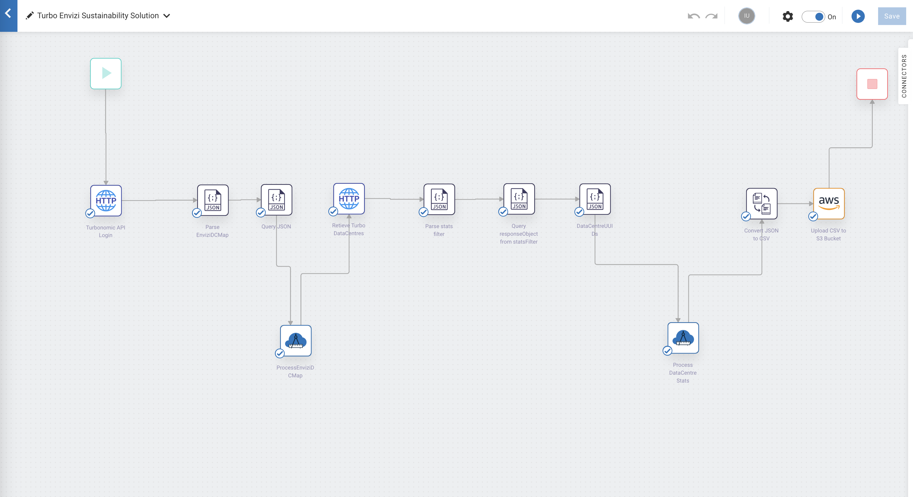

</details>


## 4. Execute the Workflow

<details><summary>CLICK me for detailed instructions</summary>

1. Click `ON` (1) to activate the Workflow

2. Click on Run button (2) to start the workflow.

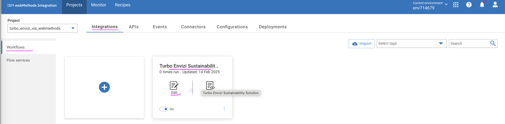

</details>


## 5. Check the result in Envizi

<details><summary>CLICK me for detailed instructions</summary>

#### 5.1. Data in S3

The workflow should have pushed the data from Turbonomic into Envizi's S3. 

You can see the Data flow status in S3 like this.

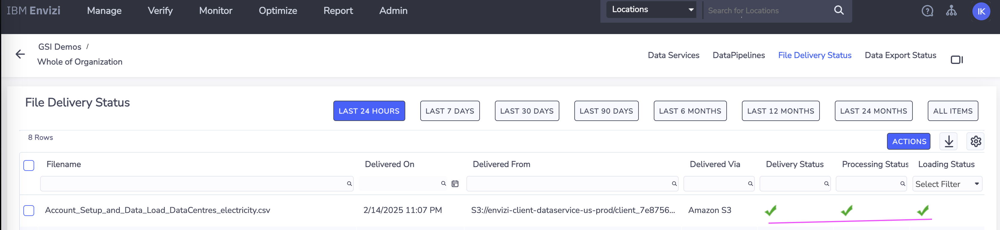

#### 5.2. Sample Data from S3

The sample data received in S3 from Turbonomic is available [here](./files/sample/).

#### 5.3. Processing S3 files in Envizi

Envizi automatically pull the data from S3 and process it. The accounts and account summary page could look like this now.

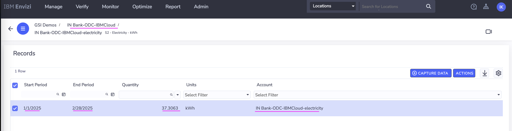


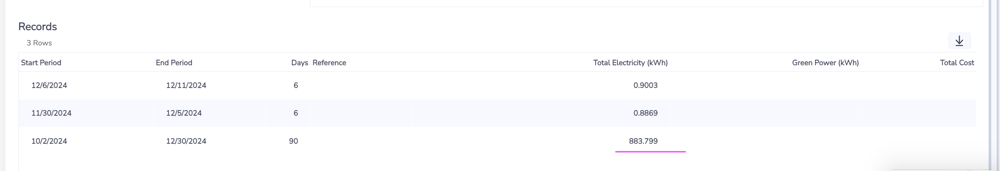

</details>

## 6. Schedule Workflow Execution

The workflow can be scheduled for execution. Follow the steps below to define the schedule for workflow execution.

<details><summary>CLICK me for detailed instructions</summary>

1. Mouse over the `Trigger` node in the workflow 

2. Click on `Settings`

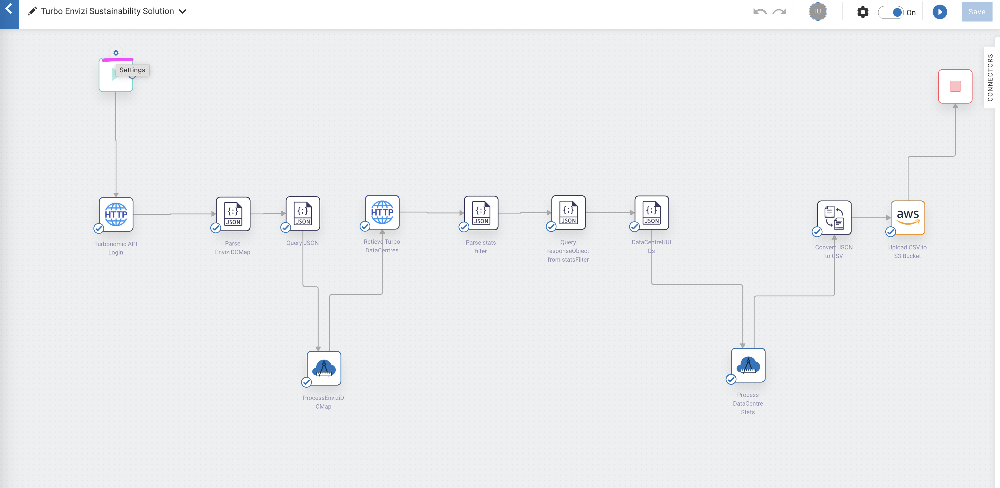

3. Select `Clock` option

4. Click on `Next` button.

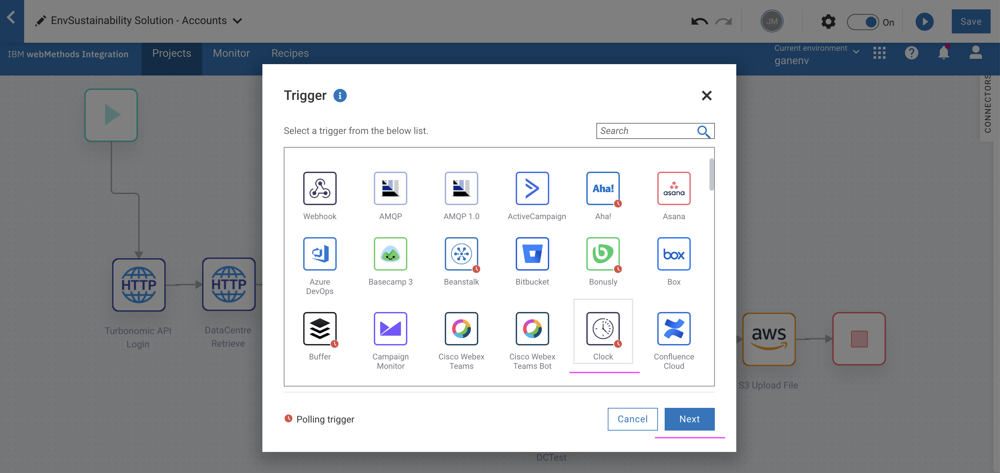

5. Change the schedule as per your need 

6. Click on `Done` button

 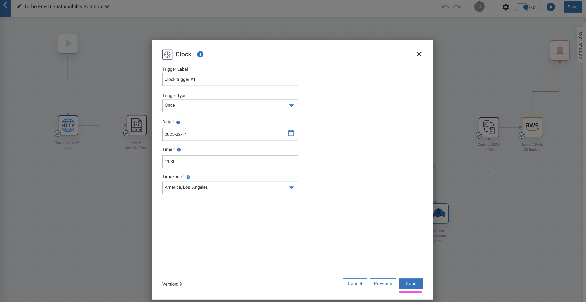

The schduling is done and the Trigger node shows the clock icon.

7. Click on `Save` button to save the workflow.

 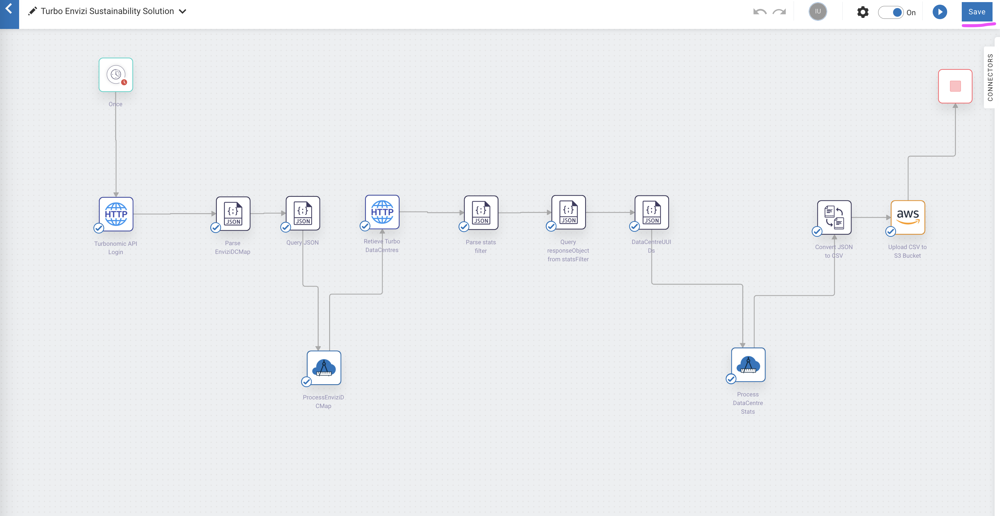

Now the workflow will execute automatically as per the defined schedule.

</details>

## Appendix

### 1. Create User in Turbonomoic

Let us create a local user in Turbonomic with the `Observer` role.

<details><summary>CLICK me for detailed instructions</summary>

1. Create a new Local user in Turbonomoic by choosing the below menu option.

`Home > SETTINGS > Local User >  New Local User`


2. User name could be `demo_observer`, give some password and choose role as `Observer`

3. Click `Save` button

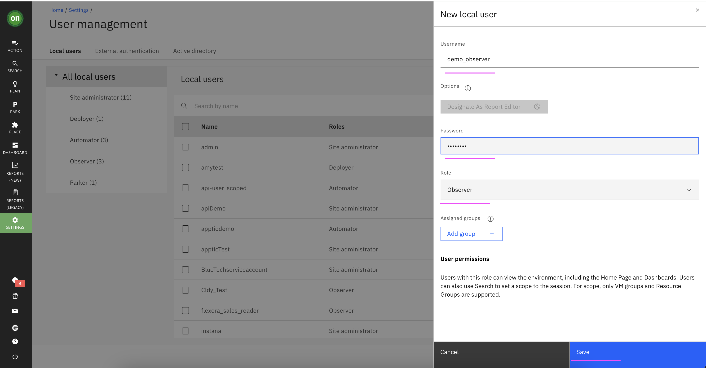

4. User is created.

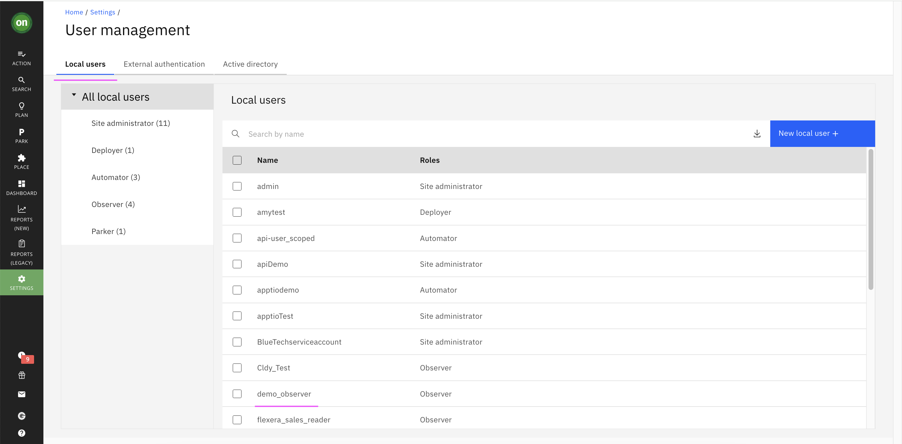

</details>

### 2. Reference

- Turbonomic - Envizi Integration https://ibm.github.io/IBM-Sustainability-Software-Portfolio-Connectors/turbonomic-envizi/

- Turbonomic - Envizi Integration https://github.com/IBM/turbonomic-envizi-appconnect-flows

- Creating Envizi S3 bucket (Refer Steps 1 and 2 [here](https://developer.ibm.com/tutorials/awb-sending-udc-excel-to-s3/) to create the bucket)

- Getting started with the Turbonomic REST API : https://www.ibm.com/docs/en/tarm/8.13.6?topic=reference-getting-started-turbonomic-rest-api

- IBM Envizi ESG Suite https://www.ibm.com/docs/en/envizi-esg-suite

- Integrate your ESG Data into Envizi using Integration Hub	https://developer.ibm.com/tutorials/awb-envizi-integration-hub/

- Sign up for webMethods SaaS Trial https://signup.softwareag.cloud/#/basic-b


#### Tags
#envizi
#Sustainability
#turbonomic

#ESG Data and Environmental Intelligence
#sustainability-highlights-home