# Integrating Turbo with Envizi via webMethods for Green IT data

This blog explains about the step-by-step instructions to pull green IT data from Turbonomic into Envizi via webMethods Integration.

#### Authors
 [Jeya Gandhi Rajan M](https://community.ibm.com/community/user/envirintel/people/jeya-gandhi-rajan-m1)  
 [Madhukrishna Parike]()  
 [JYOTI RANI]()  
 [INDIRA KALAGARA]()

## Contents

- [1. Prerequisite](#1-Prerequisite)
- [2. Architecture](#2-Architecture)
- [3. Turbonomic Configuration ](#3-Turbonomic-Configuration)
- [4. Envizi's S3 bucket ](#4-envizis-s3-bucket)
- [5. webMethods Locations Workflow Configuration](#5-webMethods-Locations-Workflow-Configuration)
- [6. webMethods Accounts Workflow Configuration](#6-webMethods-Accounts-Workflow-Configuration)
- [7. Validate Workflow Execution](#7-Validate-Workflow-Execution)
- [8. Schedule Workflow Execution](#8-Schedule-Workflow-Execution)

## 1. Prerequisite

- Turbonomic v8.14.3 or higher 
- A user with `Observer` role in Turbonomic. (Refer [here](#user-content-1-create-user-in-turbonomoic-user) to create the user)
- Envizi's S3 bucket (Refer Steps 1 and 2 [here](https://developer.ibm.com/tutorials/awb-sending-udc-excel-to-s3/) to create the bucket)
- webMethods SaaS or on-prem

## 2. Architecture

Here is the architecture  that describes about this Turbo and Envizi integration.

webMethods Integration flow pulls the list of Cloud Regions and On-prem Data Centers from Turbo and sends it to Envizi's S3 bucket in a CSV file. This CSV file will be further processed by the Envizi internally.

## 3. webMethods Locations Workflow Configuration

#### 3.1. Login to webMethods Integration

- Login to your instance of webMethods integration with the respective credentials.

#### 3.2. Create a new Project

- Name Project Name as `Turbo_wM_Envizi` and Leave `Source Control - Git server/account` as Default. Note choose the project name as you desired.

#### 3.3. Import the Workflows

- Download the Workflow archive file here [Locations](./files/webMethods-archives/Locations).
- Click on the `Import` and select the Workflow location that is downloaded in the above step.

#### 3.4. Provide Workflow name, Workflow description, AWS service

- Provide the `Workflow name` as `Sustainability Solution - Locations` and `Workflow description`. Please name the `Workflow name` and `Workflow description` as per your need.
- For the `Connect to Amazon Web Services` configuration details, please click on `+` symbol
- Configure the `Add Account` AWS page with `Account Name`, `Access Key ID`, `Secret Access Key` and `Default Region`.
- Click on `Import` button

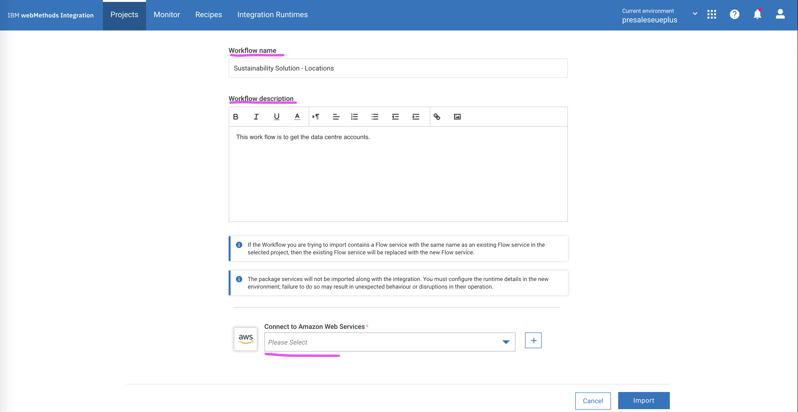

#### 3.5. Configure the Workflow nodes

- In this step Workflow nodes configuration needs to be updated.

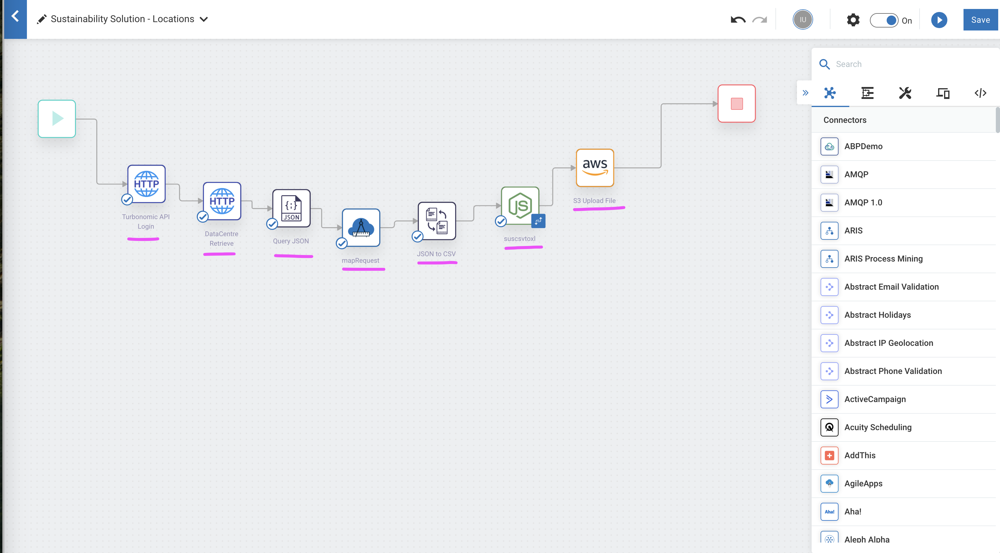

#### 3.5.1. Configure the node `Turbonomic API Login`

- Mouse over to `Turbonomic API Login` node and click on `Settings`
- Click on `Next`
- In the `Action configure` page choose as below
- Select HTTP Method: `POST`
- URL: `https://[Turbonomic-URL]/api/v3/login?hateoas=true`

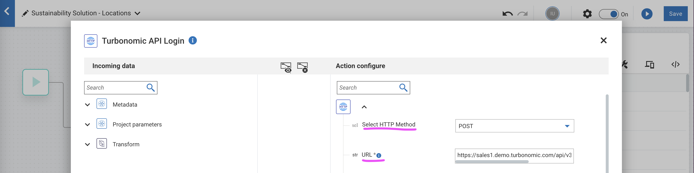

#### URL Params

- Under `URL Param 1` Key and Value to be updated
- Key: `hateoas`
- Value: `true`

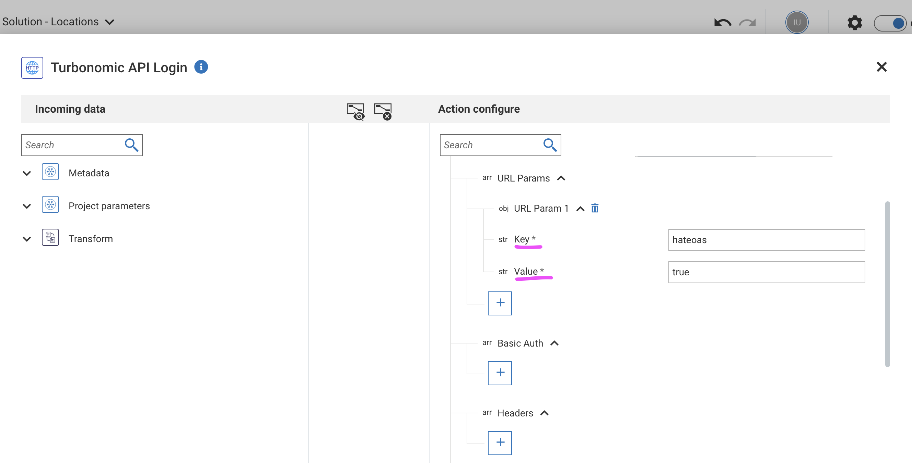

#### Set Body Type

- Set Body Type: `x-www-form-urlencoded`

#### Body

- Note: `username` and `password` to access the Turbonomic API's can be created using link [User-Creation](https://github.com/GandhiCloudLab/turbonomic-api)
- Under `Body 1` Name & Value to be updated
- Name: `username`
- Value: `Value of the username`
- Under `Body 2` Name & Value to be updated
- Name: `password`
- Value: `Value of the password`

- Rest of the values to be left as is.
- Click on `Next`

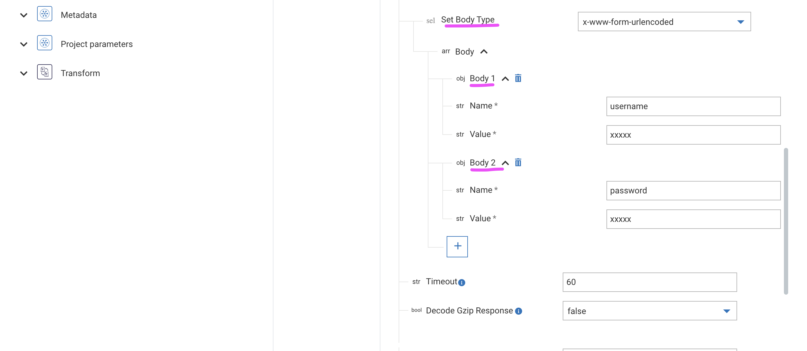

#### Test this action

- Click on `Test` button to see if the login is successful and Click on `Done` button once it is success.

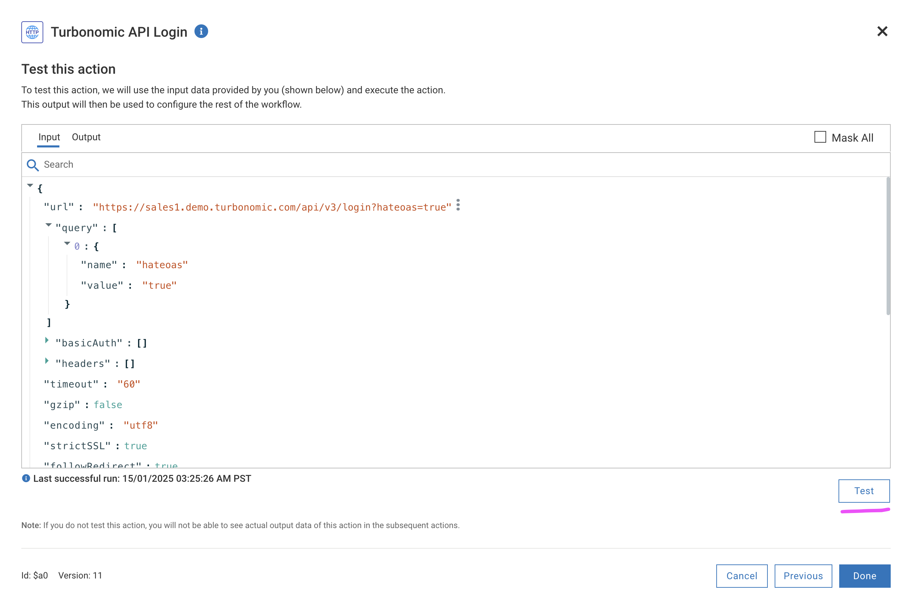

#### 3.5.2. Configure the node `DataCentre Retrieve`

- Mouse over to `DataCentre Retrieve` node and click on `Settings`
- Click on `Next`
- In the `Action configure` page choose as below
- Select HTTP Method: `GET`
- URL: `https://[Turbonomic-URL]]/api/v3/search?types=DataCenter`

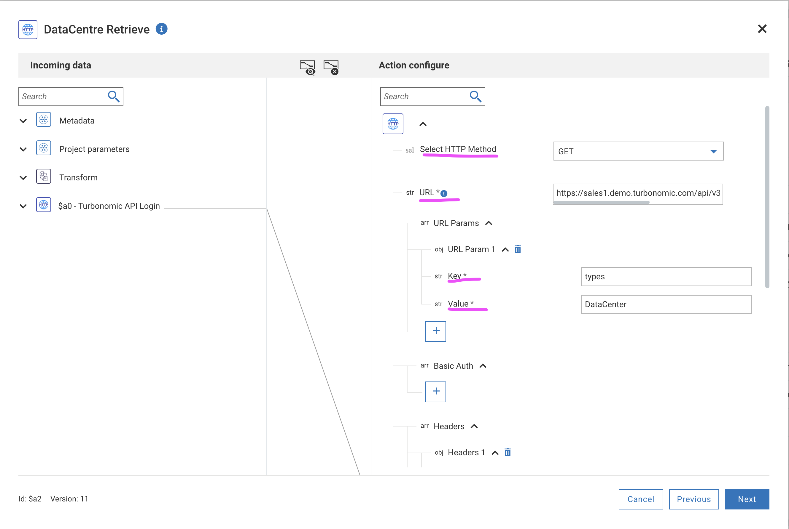

#### Headers

- Under `Headers` 'Headers 1' Key & Value to be provided
- Key: `Cookie`
- Value: Drag and drop the `set-cookie` from the `Turbonomic API Login` node as shown in the screen
- Click on `Next`

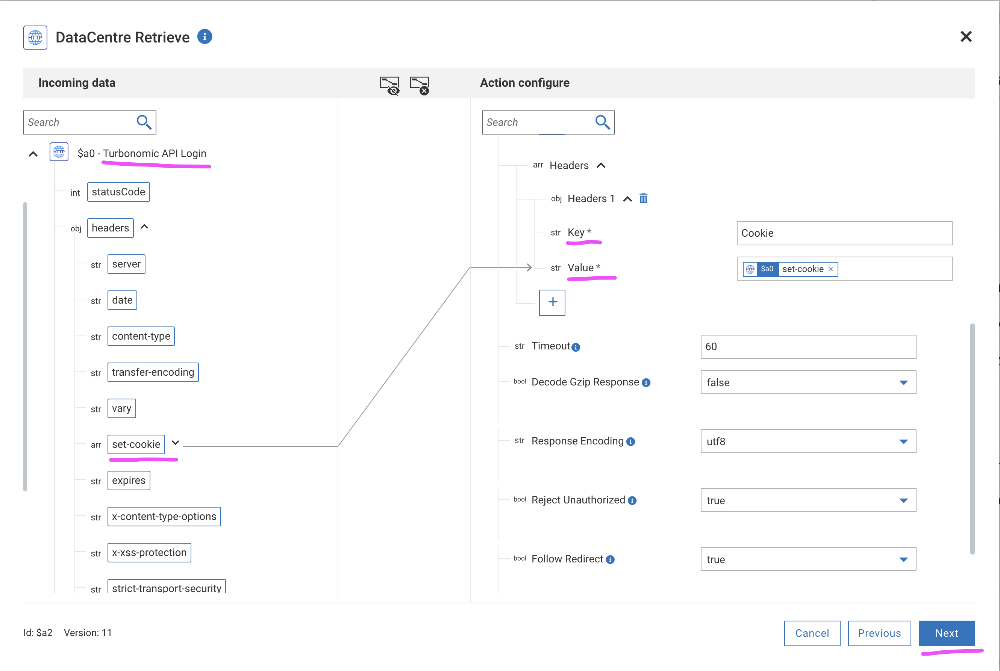

#### Test this action

- Click on `Test` button to see if the DataCentre Retrieval is successful and Click on `Done` button once it is success.

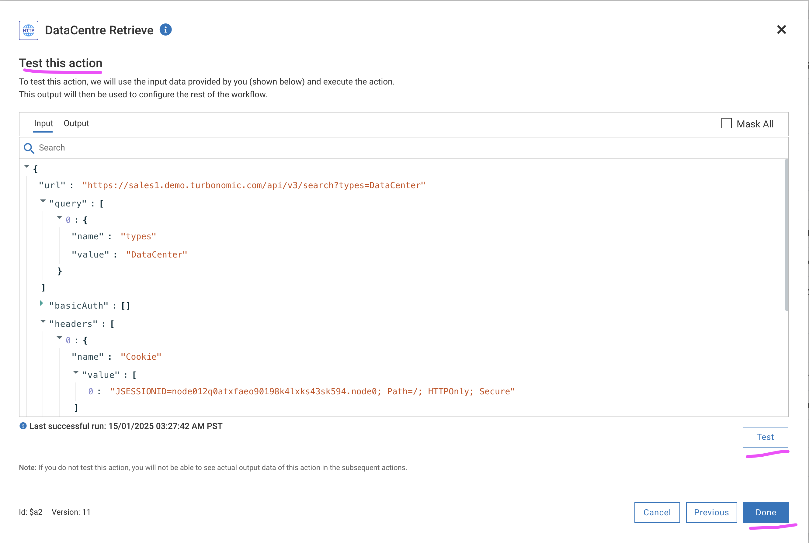

#### 3.5.3. Configure the node `Query JSON`

- Mouse over to `Query JSON` node and click on `Settings`
- Click on `Next`
- In the `Action configure` page choose as below
- Under `Query JSON` provide `JSON Data` and `JSON Path Expression`
- JSON Data: Drag and Drop of previous node object `DataCentre Retrieve`
- JSON Path Expression: `responseObject`
- Click on `Next` button

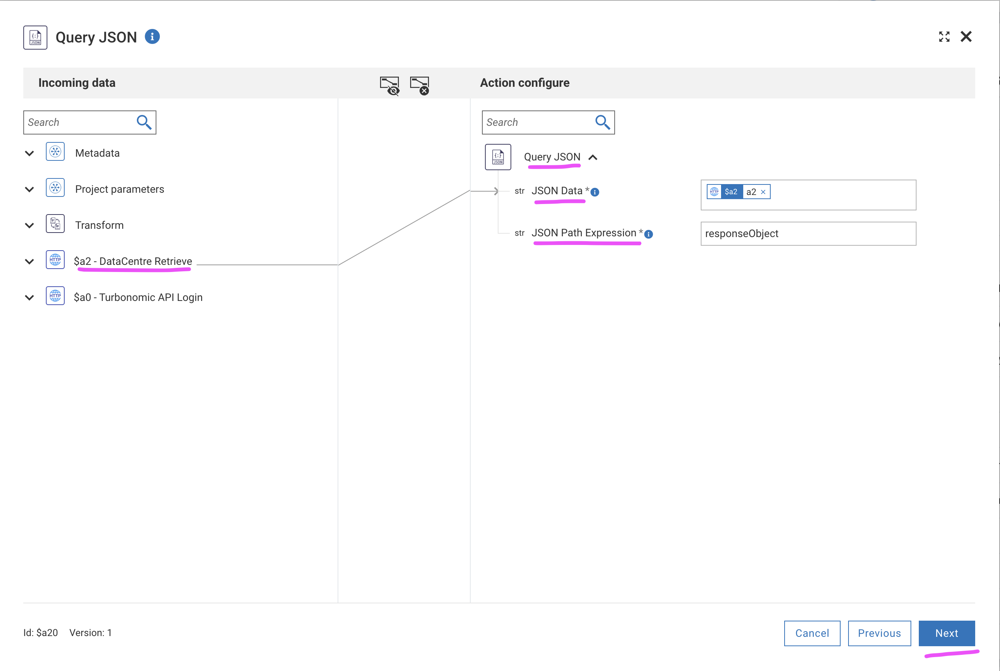

#### Test this action

- Click on `Test` button to see if the Query JSON is successful and Click on `Done` button once it is success.

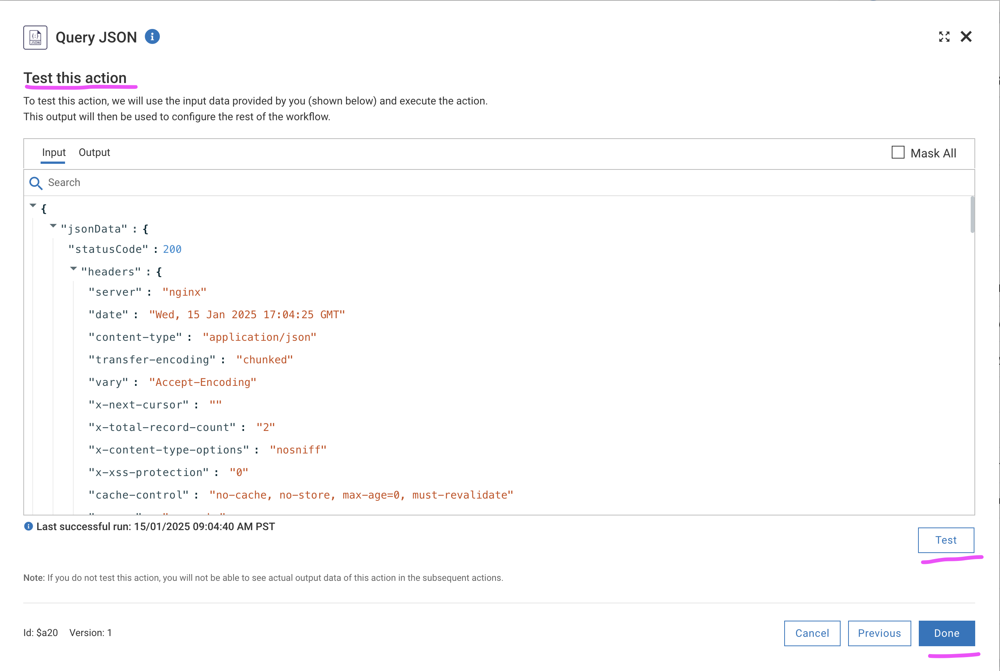

#### 3.5.4. Configure the node `mapRequest`

- This is a flow service which customize and maps the request to the custom output. For example selecting specific columns, hard-coding the selected columns etc.,
- Mouse over to `mapRequest` node and click on `Settings`
- Click on `Next`
- In the `Action configure` page drag and drop `Query JSON` object in the `request` at mapRequest.
- Click on `Next` button

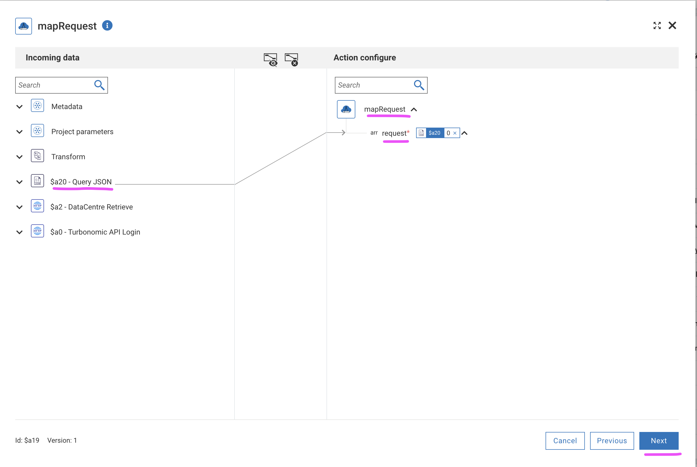

#### Test this action

- Click on `Test` button to see if the `mapRequest` is successful and Click on `Done` button once it is success.

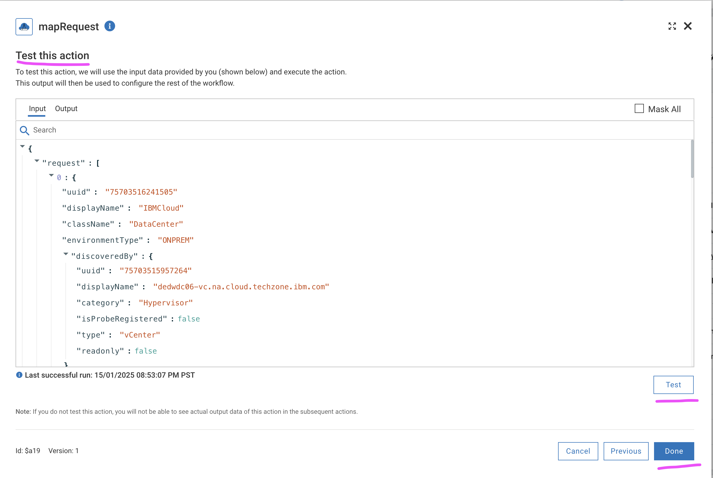

#### 3.5.5. Configure the node `JSON to CSV`

- Mouse over to `JSON to CSV` node and click on `Settings`
- Click on `Next`
- In the `Action configure` page drap and drop `mapRequest` on to value of the `Inpurt JSON`.
- Header Type: `key` from the drop down list
- Click on `Next`

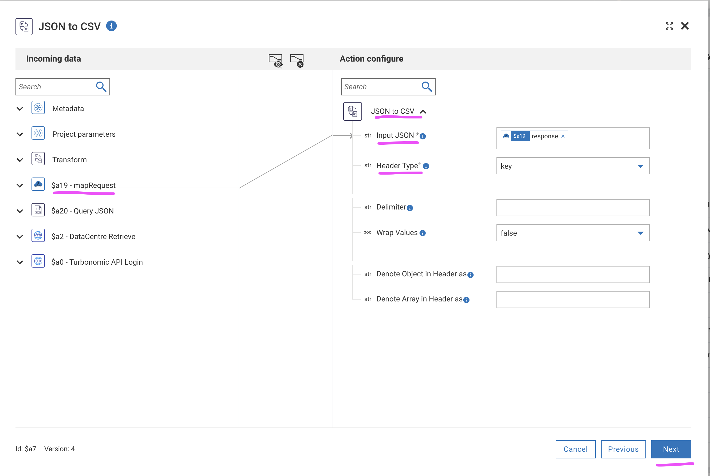

#### Test this action

- Click on `Test` button to see if the `JSON to CSV` is successful and Click on `Done` button once it is success.

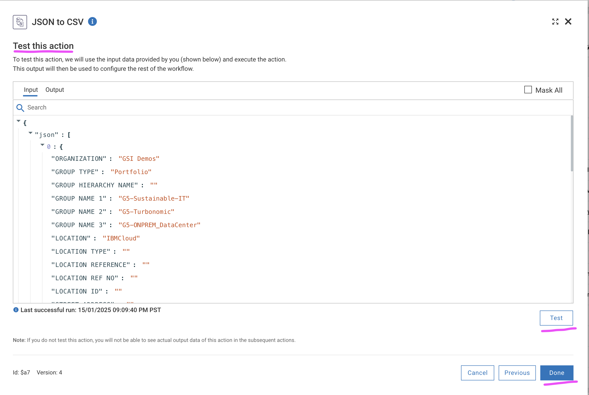

#### 3.5.6. Configure the node `suscsvtoxl`

- This is a customized connector which transform the CSV format into xlsx format.
- Mouse over to `suscsvtoxl` node and Click on `Settings`
- Click on `Next`
- In the `Action configure` page drap and drop `value` from the Transform onto `CSV File(Base64)` in the `Convert CSV to XLSX input` as shown below
- Click on `Next`

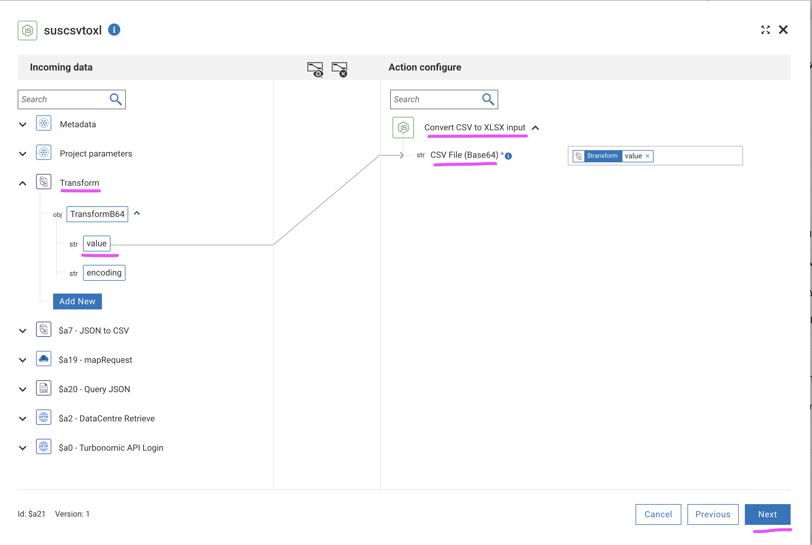

#### Test this action

- Click on `Test` button to see if the `suscsvtoxl` is successful and Click on `Done` button once it is success.

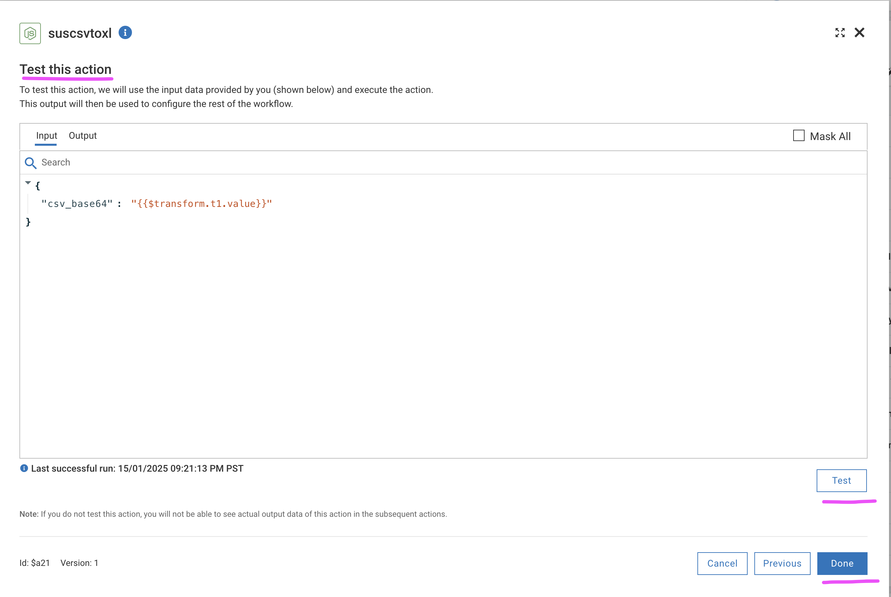

#### 3.5.7. Configure the node `S3 Upload File`

- Mouse over to `S3 Upload File` node and Click on `Settings`
- Click on `Next`
- Fill the details as below
- Select action: `S3 Upload File`
- Name: `S3 Upload File` .  Name can be updated as per need.
- Connect to Amazon Web Services: `AWS_1` . This is the AWS service created step 5.4
- Click `Next`

#### Bucket Name and other configuration

- Pleaes note AWS S3 bucket details provided as part of step 4
- Upload File: `Content`
- Raw Data: Drap and Drop the `XLSX Data(Binary)` under suscsvtoxl
- Bucket Name: s3 bucket name provided in step 4
- File Name: Folder/filename provided in step 4. File name format as Envizi_SetupConfig_G5_YYYYMMDD.xlsx
- ACL: `bucket-owner-full-control`
- Region: region provided in step 4
- Content-Type: `application/vnd.openxmlformats-officedocument.spreadsheetml.sheet`
- Click `Next`

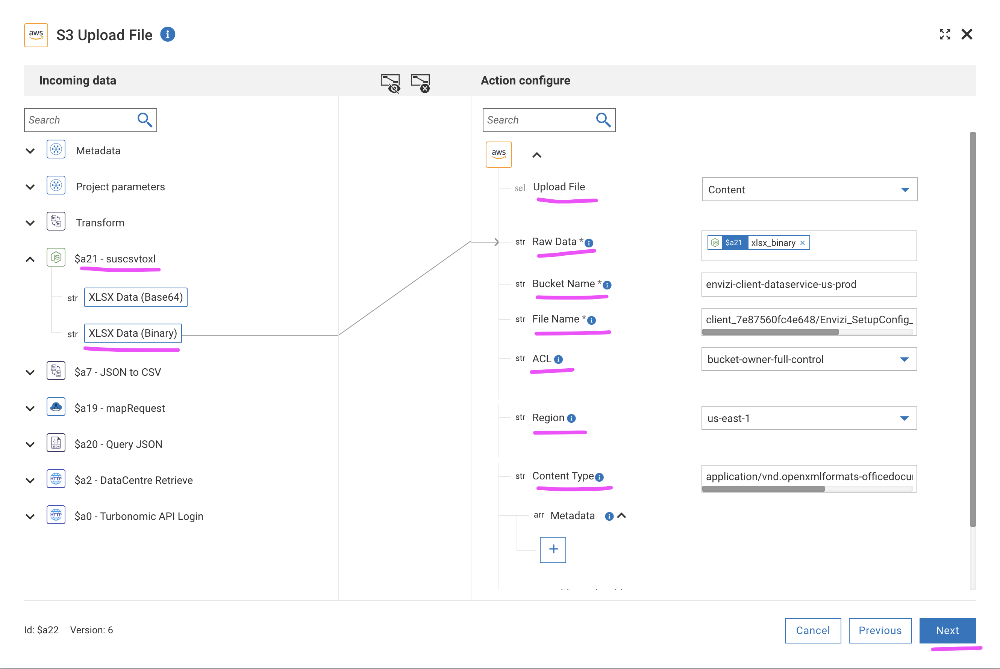

#### Test this action

- Click on `Test` button to see if the `S3 Upload File` is successful and Click on `Done` button once it is success.

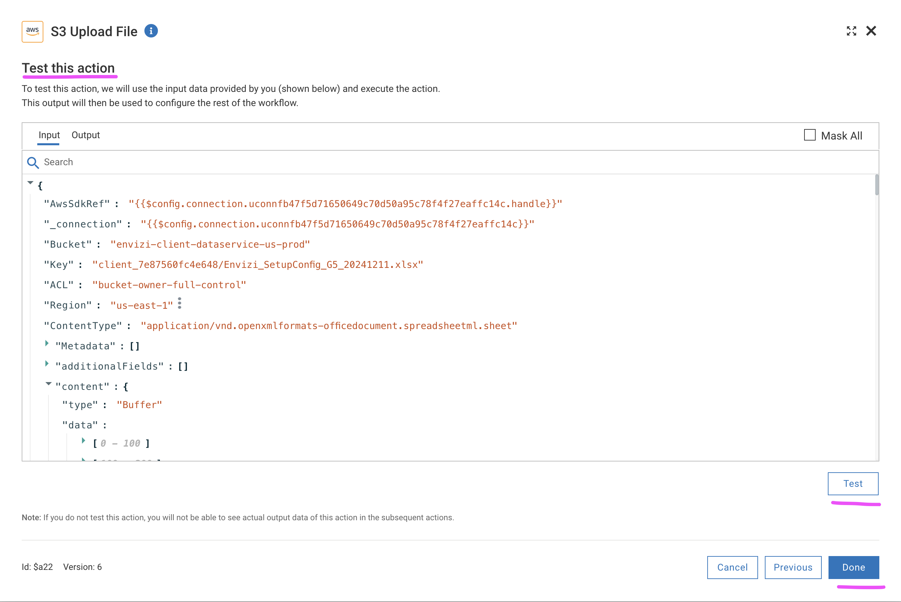

#### 3.6. Activate the Workflow

- Toggle `ON` the workflow to activate

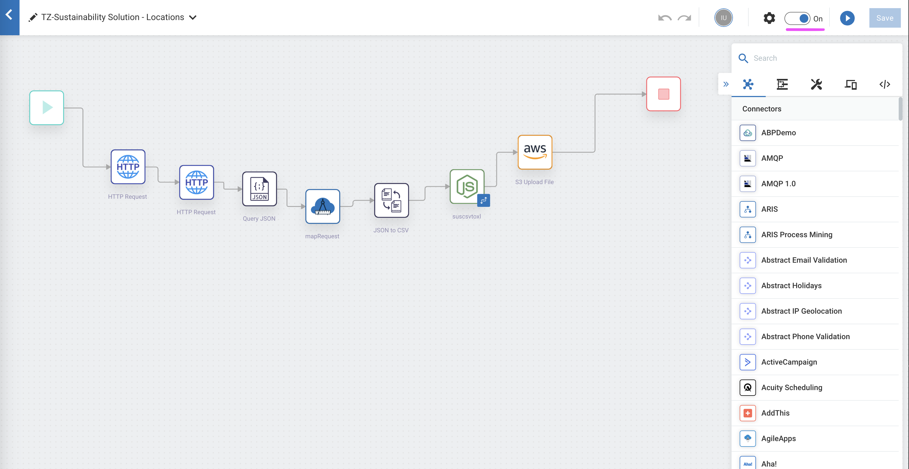

#### 3.7. Run the Workflow

- Click on the run the workflow to generate the location feed and push the feed to AWS S3 bucket.

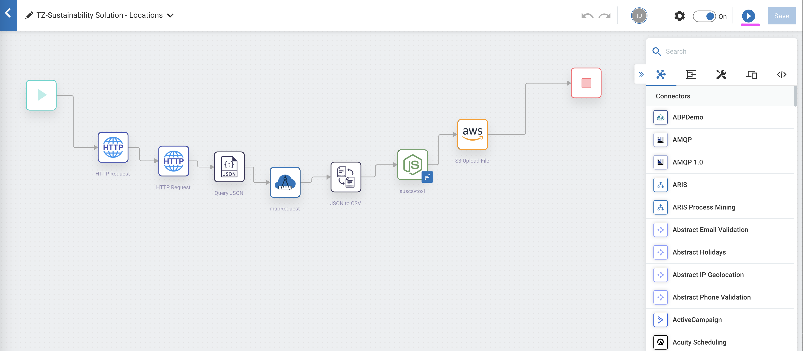

## 4. webMethods Accounts Workflow Configuration

#### 4.1. Login to webMethods Integration

- Login to your instance of webMethods integration with the respective credentials.

#### 4.2. Create a new Project

- Name Project Name as `Turbo_wM_Envizi` and Leave `Source Control - Git server/account` as Default. Note choose the project name as you desired.

#### 4.3. Import the Workflows

- Download the Workflow archive file here [Accounts](./files/webMethods-archives/Accounts).
- Click on the `Import` and select the Workflow location that is downloaded in the above step.

#### 4.4. Provide Workflow name, Workflow description, AWS service

- Provide the `Workflow name` as `Sustainability Solution - Accounts` and `Workflow description`. Please name the `Workflow name` and `Workflow description` as per your need.
- For the `Connect to Amazon Web Services` configuration details, please click on `+` symbol
- Configure the `Add Account` AWS page with `Account Name`, `Access Key ID`, `Secret Access Key` and `Default Region`.
- Click on `Import` button

- Click on `Edit` by moving mouse over the Workflow imported above.

#### 4.5. Configure the Workflow nodes

- In this step Workflow nodes configuration needs to be updated.

#### 4.5.1. Configure the node `Turbonomic API Login`

- Mouse over to `Turbonomic API Login` node and click on `Settings`
- Click on `Next`
- In the `Action configure` page choose as below
- Select HTTP Method: `POST`
- URL: `https://[Tubonomic-URL]]/api/v3/login?hateoas=true`

#### URL Params

- Under `URL Param 1` Key and Value to be updated
- Key: `hateoas`
- Value: `true`

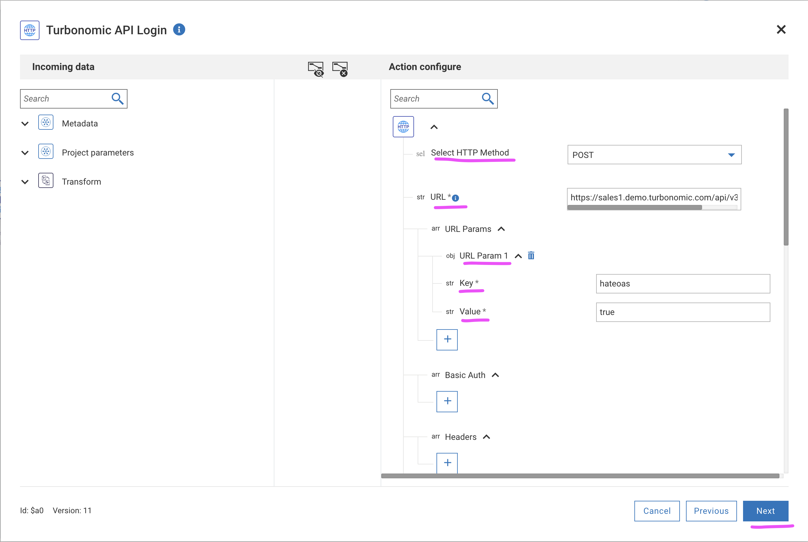

#### Set Body Type

- Set Body Type: `multipart-form-data`

#### Body

- Note: `username` and `password` to access the Turbonomic API's can be created using link [User-Creation](https://github.com/GandhiCloudLab/turbonomic-api)
- Under `Body 1` Name & Value to be updated
- Name: `username`
- Value: `Value of the username`
- Under `Body 2` Name & Value to be updated
- Name: `password`
- Value: `Value of the password`

- Rest of the values to be left as is.
- Click on `Next`

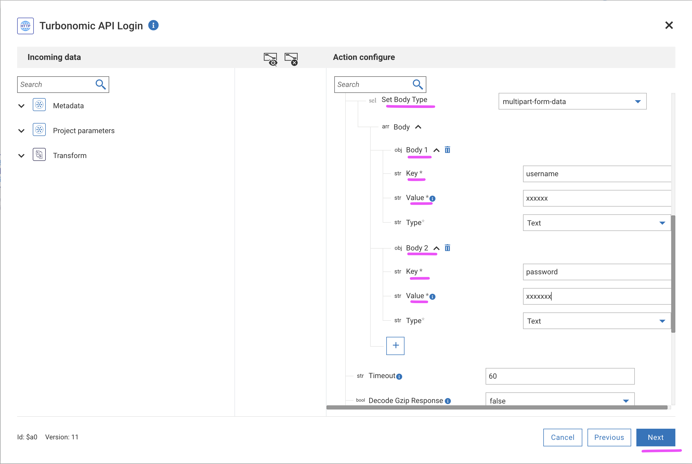

#### Test this action

- Click on `Test` button to see if the login is successful and Click on `Done` button once it is success.

#### 4.5.2. Configure the node `DataCentre Retrieve`

- Mouse over to `DataCentre Retrieve` node and click on `Settings`
- Click on `Next`
- In the `Action configure` page choose as below
- Select HTTP Method: `GET`
- URL: `https://[Turbonomic-URL]]/api/v3/search?types=DataCenter`

#### URL Params

- Provide `Key` and `Value` under 'URL Param 1'
- Key: `types`
- Value: `DataCentre`

#### Headers

- Under `Headers` 'Headers 1' Key & Value to be provided
- Key: `Cookie`
- Value: Drag and drop the `set-cookie` from the `Turbonomic API Login` node as shown in the screen
- Click on `Next`

#### Test this action

- Click on `Test` button to see if the DataCentre Retrieval is successful and Click on `Done` button once it is success.

#### 4.5.3. Configure the node `DC Accounts Stats`

- Mouse over to `DC Accounts Stats` node and click on `Settings`
- Click on `Next`
- In the `Action configure` page choose as below
- Select HTTP Method: `POST`
- URL: `https://[Turbonomic-URL]]/api/v3/entities/{{$a3.responseObject.0.uuid}}/stats` . Note {{$a3.responseObject.0.uuid}} is the `uuid` from preveious API call which can be drag and drop from `responseObject` under `DataCentre Retrieve` as shown below

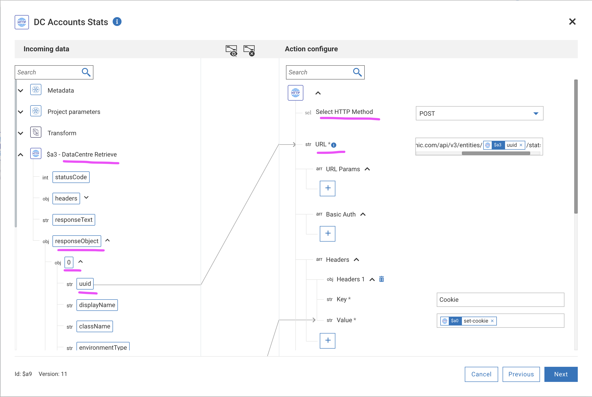

#### Headers

- Under `Headers` Headers 1 Key & Value to be provided
- Key: `Cookie`
- Value: Drag and drop the `set-cookie` from the `Turbonomic API Login` node as shown in the screen

#### Set Body Type and Body
- Set Body Type: `JSON`
- Body: `{"data":{
"startDate":"2024-12-06 00:00:05", "endDate": "2024-12-10 23:59:59","statistics": [
{
"name": "Energy",
"filters": [
{
"type": "relation",
"value": "sold"
}]}]}}`
- Please note: The `startDate` and `endDate` has to be updated edited to retrieve the stats.
- Click on `Next`
- The rest of the values to be left as is.

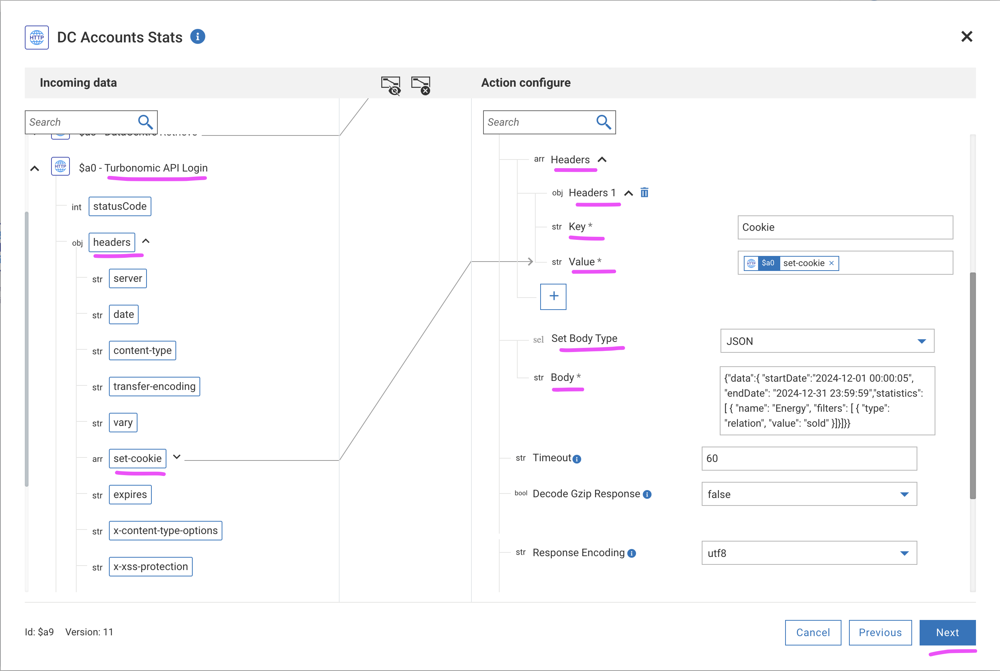

#### Test this action

- Click on `Test` button to see if the DC Accounts Stats is successful and Click on `Done` button once it is success.

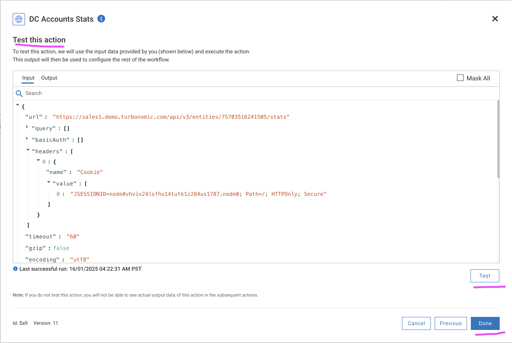

#### 4.5.4. Configure the node `Query JSON`

- Mouse over to `Query JSON` node and click on `Settings`
- Click on `Next`
- In the `Action configure` page choose as below
- JSON Data: Drag and Drop the `DC Accounts Stats` onto `JSON Data`
- JSON Path Expression: `responseObject`
- Click on `Next`

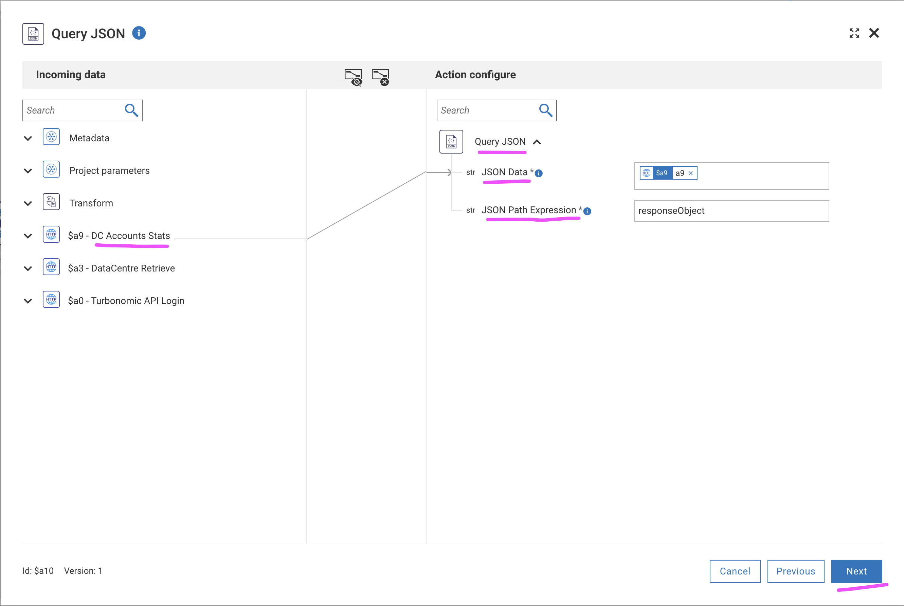

#### Test this action

- Click on `Test` button to see if the `Query JSON` is successful and Click on `Done` button once it is success.

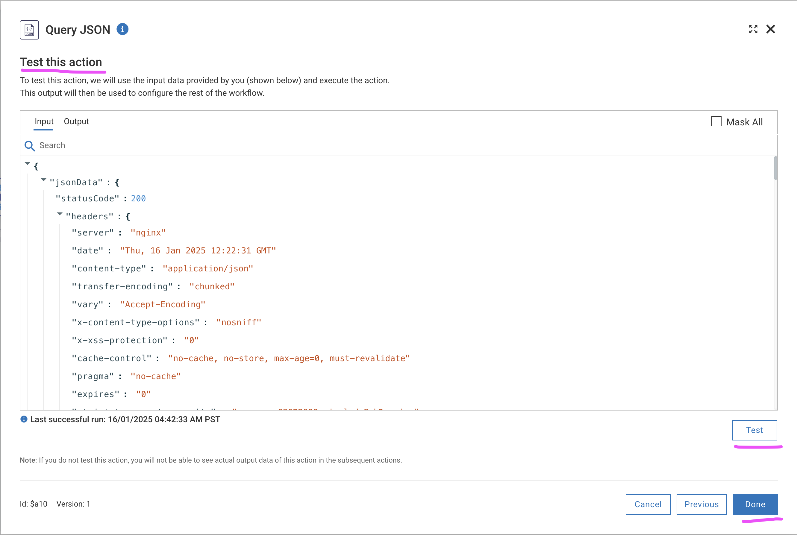

#### 4.5.5. Configure the node `AccountsMap`

- Mouse over to `AccountsMap` node and click on `Settings`
- Click on `Next`
- In the `Action configure` page choose as below
- under `AccountsMap`
- request: Drag and Drop of `Query JSON`
- Click on `Next`

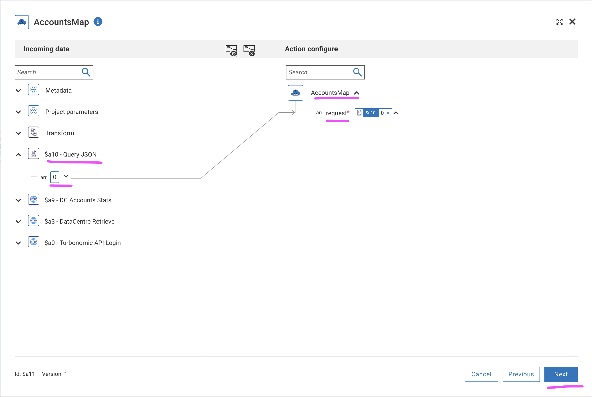

#### Test this action

 Click on `Test` button to see if the `AccountsMap` is successful and Click on `Done` button once it is success.

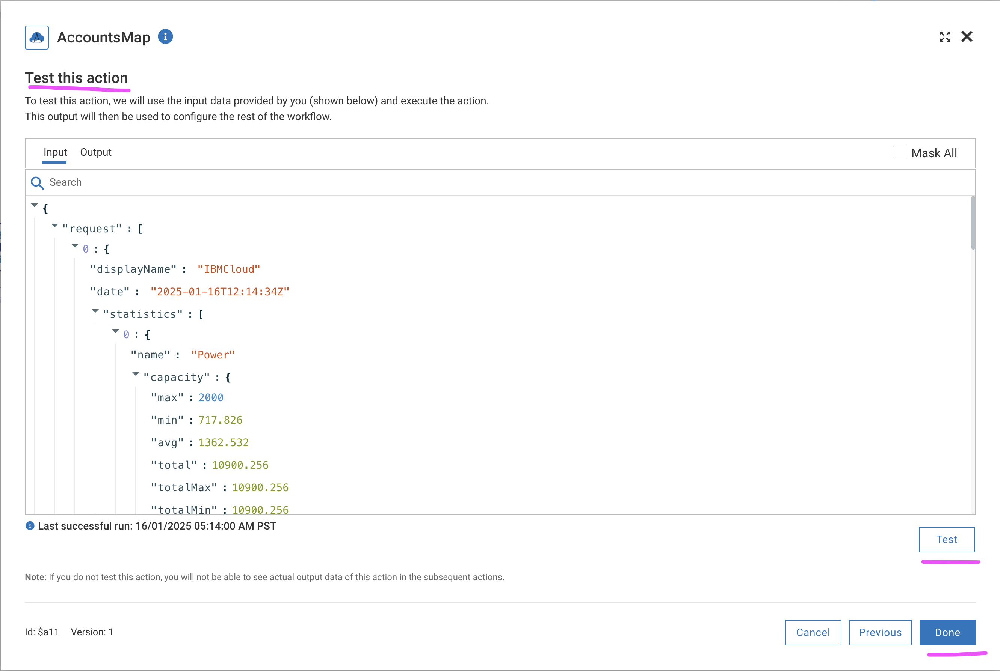

#### 4.5.6. Configure the node `JSON to CSV`

- Mouse over to `JSON to CSV` node and click on `Settings`
- Click on `Next`
- In the `Action configure` page choose as below
- under `JSON to CSV`
- Input JSON: Drag and Drop `response` from AccountsMap
- Header Type: `Key`
- Rest of the values leave as is.
- CLick on `Next`

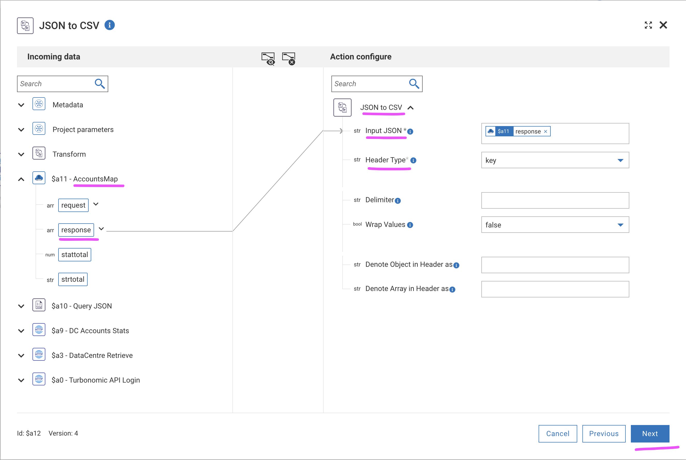

#### Test this action

 Click on `Test` button to see if the `JSON to CSV` is successful and Click on `Done` button once it is success.

 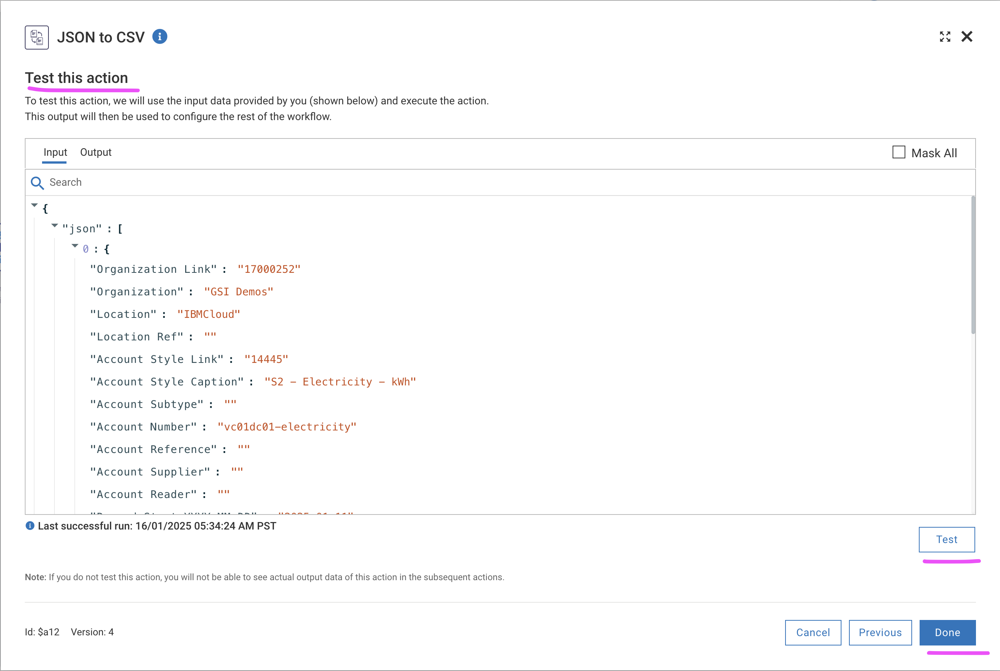

 #### 4.5.7. Configure the node `S3 Upload File`

- Mouse over to `S3 Upload File` node and Click on `Settings`
- Click on `Next`
- Fill the details as below
- Select action: `S3 Upload File`
- Name: `S3 Upload File` .  Name can be updated as per need.
- Connect to Amazon Web Services: `AWS_1` . This is the AWS service created step 5.4
- Click `Next`

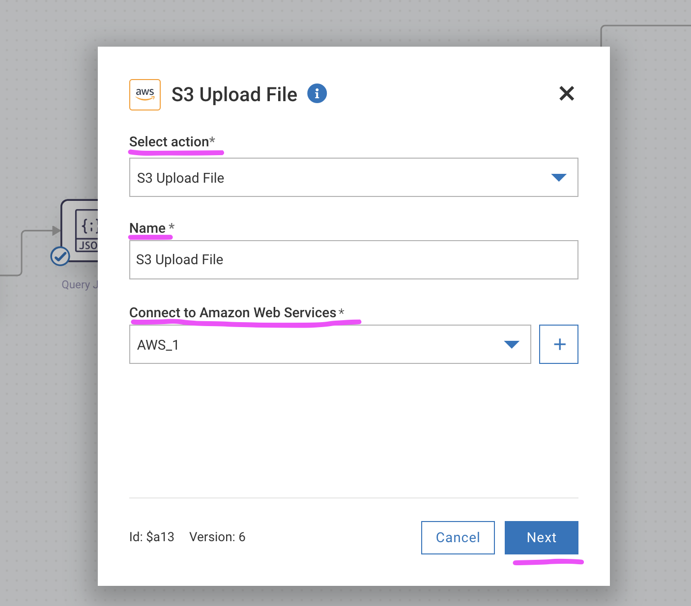

#### Bucket Name and other configuration

- Pleaes note AWS S3 bucket details provided as part of step 4
- Upload File: `Content`
- Raw Data: Drap and Drop the `csv` under `JSON to CSV`
- Bucket Name: s3 bucket name provided in step 4
- File Name: Folder/filename provided in step 4. File name format as Account_Setup_and_Data_Load_IBMCloud_electricity.csv
- ACL: `bucket-owner-full-control`
- Region: region provided in step 4
- Content-Type: `text/csv`
- Click `Next`

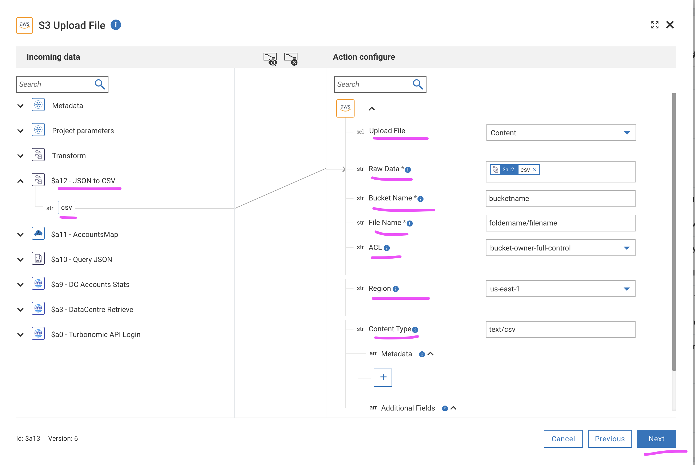

#### Test this action

- Click on `Test` button to see if the `S3 Upload File` is successful and Click on `Done` button once it is success.

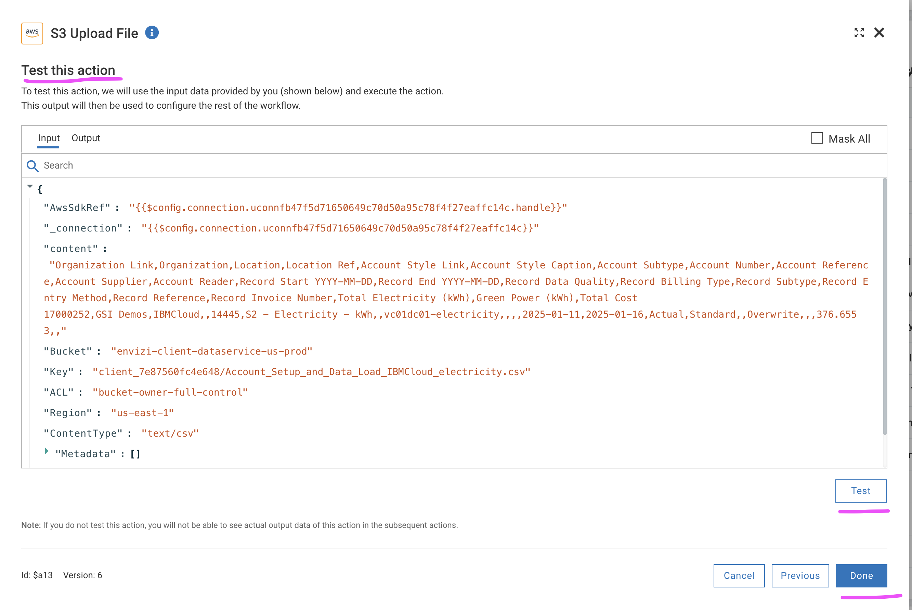

#### 4.6. Activate the Workflow

- Toggle `ON` to activate the Workflow

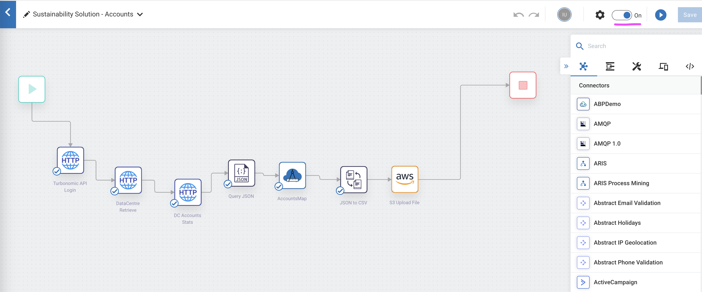

#### 4.7. Run the Workflow

- Run the Workflow to push the DataCentre electricity consumption stats to Envizi

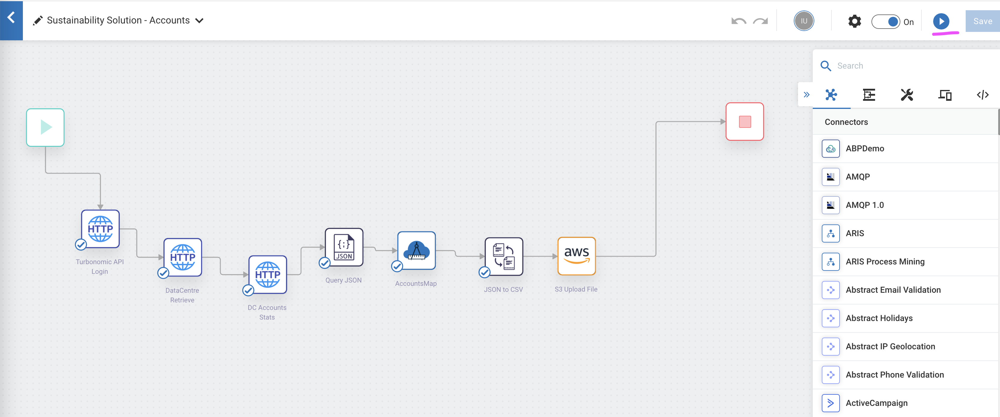

## 5. Validate Workflow Execution

#### 5.1. Data in S3

- The flows will pull the data from the Turbo and push it to S3. You can see the Data flow status in S3 like this.

#### 5.2. Sample Data from S3

- The sample data is available here.  [Accounts](./files/data/accounts/),  [Locations](./files/data/locations/).

#### 5.3. Processing S3 files in Envizi

- Envizi automatically pull the data from S3 and process it. The accounts and account summary page looks like this now.

## 6. Schedule Workflow Execution

Locations and Accounts workflow can be scheduled for execution. Follow the steps below to define the schedule for workflow execution.

- Mouse over the `Trigger` node in the workflow and click on `Settings`

- From the Trigger window, search and select `Clock` and `Next`

- Change the settings to define the schedule for flow execution and click `Done`

- Save the workflow and it will execute automatically as per the defined schedule.

## Reference

Turbonomic - Envizi Integration https://ibm.github.io/IBM-Sustainability-Software-Portfolio-Connectors/turbonomic-envizi/

Turbonomic - Envizi Integration https://github.com/IBM/turbonomic-envizi-appconnect-flows

## Appendix

### 1. Create User in Turbonomoic User

1. Create a new Local user in Turbonomoic by choosing the below menu option.

`Home > SETTINGS > Local User >  New Local User`

2. User name could be `demo_observer`, give some password and choose role as `Observer`

3. Click `Save` button

4. User gets created.

### 2. Reference

- Creating Envizi S3 bucket (Refer Steps 1 and 2 [here](https://developer.ibm.com/tutorials/awb-sending-udc-excel-to-s3/) to create the bucket)

- Getting started with the Turbonomic REST API : https://www.ibm.com/docs/en/tarm/8.13.6?topic=reference-getting-started-turbonomic-rest-api

- IBM Envizi ESG Suite https://www.ibm.com/docs/en/envizi-esg-suite

- Integrate your ESG Data into Envizi using Integration Hub	https://developer.ibm.com/tutorials/awb-envizi-integration-hub/

#### Tags
#envizi
#Sustainability
#turbonomic

#ESG Data and Environmental Intelligence
#sustainability-highlights-home