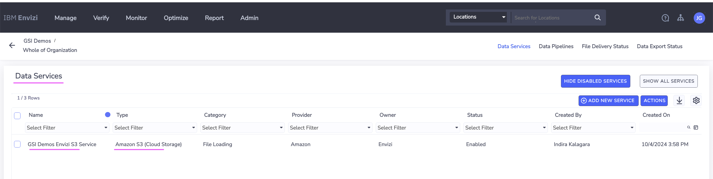
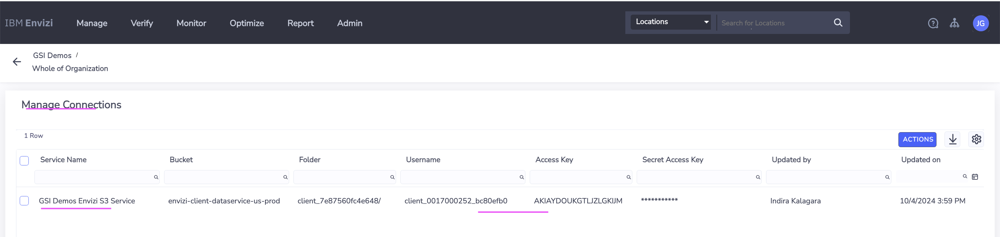
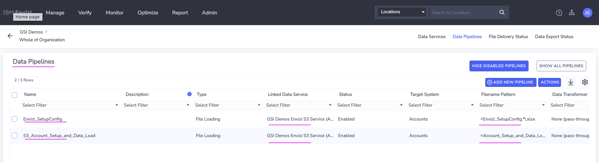
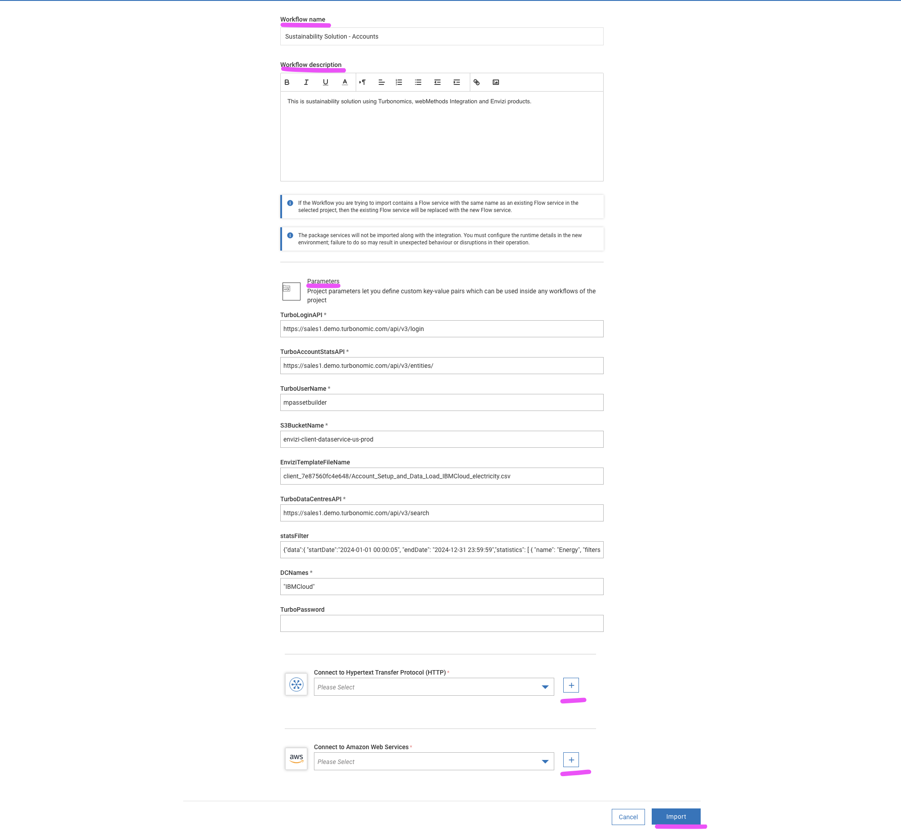
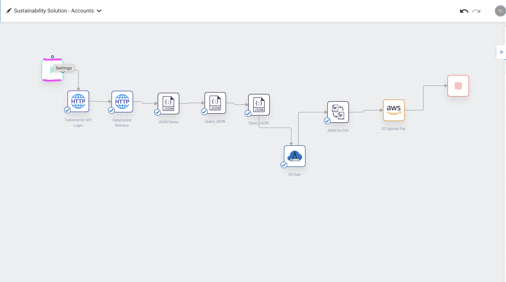

# Integrating Turbo with Envizi via webMethods for Green IT data

This blog explains about the step-by-step instructions to pull green IT data from Turbonomic into Envizi via webMethods Integration.

#### Authors
 [Jeya Gandhi Rajan M](https://community.ibm.com/community/user/envirintel/people/jeya-gandhi-rajan-m1)  
 [Madhukrishna Parike]()  
 [JYOTI RANI]()  
 [INDIRA KALAGARA]()

## Contents

- [1. Prerequisite](#1-Prerequisite)
- [2. Architecture](#2-Architecture)
- [3. Turbonomic Configuration ](#3-Turbonomic-Configuration)
- [4. Envizi's S3 bucket ](#4-envizis-s3-bucket)
- [5. webMethods Locations Workflow Configuration](#5-webMethods-Locations-Workflow-Configuration)
- [6. webMethods Accounts Workflow Configuration](#6-webMethods-Accounts-Workflow-Configuration)
- [7. Validate Workflow Execution](#7-Validate-Workflow-Execution)
- [8. Schedule Workflow Execution](#8-Schedule-Workflow-Execution)

## 1. Prerequisite

- Turbonomic v8.14.3 or higher 
- webMethods SaaS or on-prem
- Envizi's S3 bucket 

## 2. Architecture

Here is the architecture  that describes about this Turbo and Envizi integration.

webMethods Integration flow pulls the list of Cloud Regions and On-prem Data Centers from Turbo and sends it to Envizi's S3 bucket in a CSV file. This CSV file will be further processed by the Envizi internally.

## 3. Turbonomic Configuration

### Mandatory Configuration

- Create a user with `Observer` role in Turbo. webMethods needs this user to fetch data from Turbo. 

### Optional Configuration 

- Add the following Tag in vCenter and add their values as tags to the Data Centers for accurate emission calculations from Envizi:
    - `Country`: Name of Country
    - `Latitude`: Latitude in Decimal Degrees format
    - `Longitude`: Longitude in Decimal Degrees format
    

- By default, Envizi will use the Data Center name configured in Turbonomic/vCenter. To change this, Tag Category `EnviziAlternateName` can be added with the desired display name as its value.
- Envizi Locations (Data Centers in this case) need unique display names. If there are any Data Centers with same names, they should be changed from vCenter or Tag Category `EnviziAlternateName` should be added to the Data Center(s) with different name(s)

**Note:** Tags sync from vCenter to Turbonomic might take upto 20 minutes.

## 4. Envizi's S3 bucket 

S3 bucket to be created in Envizi via Data Flow Automation. This S3 bucket details to be feed into the webMethods flow.

1. Create S3 bucket in Envizi via the Data Services screen in Data flow Automation. 

Note the Accesskey and other details to use it later in webMethods.

    

    

2. Create Data pipeline to associate the Data services to the file name pattern to integrate with Envizi.

    

The webMethods flow pulls the data from Turbo and sends it to S3 bucket in a CSV file format. Envizi will further process this CSV file.

## 5. webMethods Locations Workflow Configuration

#### 5.1. Login to webMethods Integration

- Login to your instance of webMethods integration with the respective credentials.

#### 5.2. Create a new Project

- Name Project Name as `Turbo_wM_Envizi` and Leave `Source Control - Git server/account` as Default. Note choose the project name as you desired.

#### 5.3. Import the Workflows

- Download the Workflow archive file here [Locations](./files/webMethods-archives/Locations).
- Click on the `Import` and select the Workflow location that is downloaded in the above step.

#### 5.4. Provide Workflow name, Workflow description, AWS service

- Provide the `Workflow name` as `Sustainability Solution - Locations` and `Workflow description`. Please name the `Workflow name` and `Workflow description` as per your need.
- For the `Connect to Amazon Web Services` configuration details, please click on `+` symbol
- Configure the `Add Account` AWS page with `Account Name`, `Access Key ID`, `Secret Access Key` and `Default Region`.
- Click on `Import` button

#### 5.5. Configure the Workflow nodes

- In this step Workflow nodes configuration needs to be updated.

#### 5.5.1. Configure the node `Turbonomic API Login`

- Mouse over to `Turbonomic API Login` node and click on `Settings`
- Click on `Next`
- In the `Action configure` page choose as below
- Select HTTP Method: `POST`
- URL: `https://[Turbonomic-URL]/api/v3/login?hateoas=true`

#### URL Params

- Under `URL Param 1` Key and Value to be updated
- Key: `hateoas`
- Value: `true`

#### Set Body Type

- Set Body Type: `x-www-form-urlencoded`

#### Body

- Note: `username` and `password` to access the Turbonomic API's can be created using link [User-Creation](https://github.com/GandhiCloudLab/turbonomic-api)
- Under `Body 1` Name & Value to be updated
- Name: `username`
- Value: `Value of the username`
- Under `Body 2` Name & Value to be updated
- Name: `password`
- Value: `Value of the password`

- Rest of the values to be left as is.
- Click on `Next`

#### Test this action

- Click on `Test` button to see if the login is successful and Click on `Done` button once it is success.

#### 5.5.2. Configure the node `DataCentre Retrieve`

- Mouse over to `DataCentre Retrieve` node and click on `Settings`
- Click on `Next`
- In the `Action configure` page choose as below
- Select HTTP Method: `GET`
- URL: `https://[Turbonomic-URL]]/api/v3/search?types=DataCenter`

#### Headers

- Under `Headers` 'Headers 1' Key & Value to be provided
- Key: `Cookie`
- Value: Drag and drop the `set-cookie` from the `Turbonomic API Login` node as shown in the screen
- Click on `Next`

#### Test this action

- Click on `Test` button to see if the DataCentre Retrieval is successful and Click on `Done` button once it is success.

#### 5.5.3. Configure the node `Query JSON`

- Mouse over to `Query JSON` node and click on `Settings`
- Click on `Next`
- In the `Action configure` page choose as below
- Under `Query JSON` provide `JSON Data` and `JSON Path Expression`
- JSON Data: Drag and Drop of previous node object `DataCentre Retrieve`
- JSON Path Expression: `responseObject`
- Click on `Next` button

#### Test this action

- Click on `Test` button to see if the Query JSON is successful and Click on `Done` button once it is success.

#### 5.5.4. Configure the node `mapRequest`

- This is a flow service which customize and maps the request to the custom output. For example selecting specific columns, hard-coding the selected columns etc.,
- Mouse over to `mapRequest` node and click on `Settings`
- Click on `Next`
- In the `Action configure` page drag and drop `Query JSON` object in the `request` at mapRequest.
- Click on `Next` button

#### Test this action

- Click on `Test` button to see if the `mapRequest` is successful and Click on `Done` button once it is success.

#### 5.5.5. Configure the node `JSON to CSV`

- Mouse over to `JSON to CSV` node and click on `Settings`
- Click on `Next`
- In the `Action configure` page drap and drop `mapRequest` on to value of the `Inpurt JSON`.
- Header Type: `key` from the drop down list
- Click on `Next`

#### Test this action

- Click on `Test` button to see if the `JSON to CSV` is successful and Click on `Done` button once it is success.

#### 5.5.6. Configure the node `suscsvtoxl`

- This is a customized connector which transform the CSV format into xlsx format.
- Mouse over to `suscsvtoxl` node and Click on `Settings`
- Click on `Next`
- In the `Action configure` page drap and drop `value` from the Transform onto `CSV File(Base64)` in the `Convert CSV to XLSX input` as shown below
- Click on `Next`

#### Test this action

- Click on `Test` button to see if the `suscsvtoxl` is successful and Click on `Done` button once it is success.

#### 5.5.7. Configure the node `S3 Upload File`

- Mouse over to `S3 Upload File` node and Click on `Settings`
- Click on `Next`
- Fill the details as below
- Select action: `S3 Upload File`
- Name: `S3 Upload File` .  Name can be updated as per need.
- Connect to Amazon Web Services: `AWS_1` . This is the AWS service created step 5.4
- Click `Next`

#### Bucket Name and other configuration

- Pleaes note AWS S3 bucket details provided as part of step 4
- Upload File: `Content`
- Raw Data: Drap and Drop the `XLSX Data(Binary)` under suscsvtoxl
- Bucket Name: s3 bucket name provided in step 4
- File Name: Folder/filename provided in step 4. File name format as Envizi_SetupConfig_G5_YYYYMMDD.xlsx
- ACL: `bucket-owner-full-control`
- Region: region provided in step 4
- Content-Type: `application/vnd.openxmlformats-officedocument.spreadsheetml.sheet`
- Click `Next`

#### Test this action

- Click on `Test` button to see if the `S3 Upload File` is successful and Click on `Done` button once it is success.

#### 5.6. Activate the Workflow

- Toggle `ON` the workflow to activate

#### 5.7. Run the Workflow

- Click on the run the workflow to generate the location feed and push the feed to AWS S3 bucket.

## 6. webMethods Accounts Workflow Configuration

#### 6.1. Login to webMethods Integration

- Login to your instance of webMethods integration with the respective credentials.

#### 6.2. Create a new Project

- Name Project Name as `Turbo_wM_Envizi` and Leave `Source Control - Git server/account` as Default. Note choose the project name as you desired.

#### 6.3. Import the Workflows

- Download the Workflow archive file here [Accounts](./files/webMethods-archives/Accounts).
- Click on the `Import` and select the Workflow location that is downloaded in the above step.

#### 6.4. Provide Workflow name, Workflow description, AWS service

- Provide the `Workflow name` as `Sustainability Solution - Accounts` and `Workflow description`. Please name the `Workflow name` and `Workflow description` as per your need.
- For the `Connect to Amazon Web Services` configuration details, please click on `+` symbol
- Configure the `Add Account` AWS page with `Account Name`, `Access Key ID`, `Secret Access Key` and `Default Region`.
- Click on `Import` button

- Click on `Edit` by moving mouse over the Workflow imported above.

#### 6.5. Configure the Workflow nodes

- In this step Workflow nodes configuration needs to be updated.

#### 6.5.1. Configure the node `Turbonomic API Login`

- Mouse over to `Turbonomic API Login` node and click on `Settings`
- Click on `Next`
- In the `Action configure` page choose as below
- Select HTTP Method: `POST`
- URL: `https://[Tubonomic-URL]]/api/v3/login?hateoas=true`

#### URL Params

- Under `URL Param 1` Key and Value to be updated
- Key: `hateoas`
- Value: `true`

#### Set Body Type

- Set Body Type: `multipart-form-data`

#### Body

- Note: `username` and `password` to access the Turbonomic API's can be created using link [User-Creation](https://github.com/GandhiCloudLab/turbonomic-api)
- Under `Body 1` Name & Value to be updated
- Name: `username`
- Value: `Value of the username`
- Under `Body 2` Name & Value to be updated
- Name: `password`
- Value: `Value of the password`

- Rest of the values to be left as is.
- Click on `Next`

#### Test this action

- Click on `Test` button to see if the login is successful and Click on `Done` button once it is success.

#### 6.5.2. Configure the node `DataCentre Retrieve`

- Mouse over to `DataCentre Retrieve` node and click on `Settings`
- Click on `Next`
- In the `Action configure` page choose as below
- Select HTTP Method: `GET`
- URL: `https://[Turbonomic-URL]]/api/v3/search?types=DataCenter`

#### URL Params

- Provide `Key` and `Value` under 'URL Param 1'
- Key: `types`
- Value: `DataCentre`

#### Headers

- Under `Headers` 'Headers 1' Key & Value to be provided
- Key: `Cookie`
- Value: Drag and drop the `set-cookie` from the `Turbonomic API Login` node as shown in the screen
- Click on `Next`

#### Test this action

- Click on `Test` button to see if the DataCentre Retrieval is successful and Click on `Done` button once it is success.

#### 6.5.3. Configure the node `DC Accounts Stats`

- Mouse over to `DC Accounts Stats` node and click on `Settings`
- Click on `Next`
- In the `Action configure` page choose as below
- Select HTTP Method: `POST`
- URL: `https://[Turbonomic-URL]]/api/v3/entities/{{$a3.responseObject.0.uuid}}/stats` . Note {{$a3.responseObject.0.uuid}} is the `uuid` from preveious API call which can be drag and drop from `responseObject` under `DataCentre Retrieve` as shown below

#### Headers

- Under `Headers` Headers 1 Key & Value to be provided
- Key: `Cookie`
- Value: Drag and drop the `set-cookie` from the `Turbonomic API Login` node as shown in the screen

#### Set Body Type and Body
- Set Body Type: `JSON`
- Body: `{"data":{
"startDate":"2024-12-06 00:00:05", "endDate": "2024-12-10 23:59:59","statistics": [
{
"name": "Energy",
"filters": [
{
"type": "relation",
"value": "sold"
}]}]}}`
- Please note: The `startDate` and `endDate` has to be updated edited to retrieve the stats.
- Click on `Next`
- The rest of the values to be left as is.

#### Test this action

- Click on `Test` button to see if the DC Accounts Stats is successful and Click on `Done` button once it is success.

#### 6.5.4. Configure the node `Query JSON`

- Mouse over to `Query JSON` node and click on `Settings`
- Click on `Next`
- In the `Action configure` page choose as below
- JSON Data: Drag and Drop the `DC Accounts Stats` onto `JSON Data`
- JSON Path Expression: `responseObject`
- Click on `Next`

#### Test this action

- Click on `Test` button to see if the `Query JSON` is successful and Click on `Done` button once it is success.

#### 6.5.5. Configure the node `AccountsMap`

- Mouse over to `AccountsMap` node and click on `Settings`
- Click on `Next`
- In the `Action configure` page choose as below
- under `AccountsMap`
- request: Drag and Drop of `Query JSON`
- Click on `Next`

#### Test this action

 Click on `Test` button to see if the `AccountsMap` is successful and Click on `Done` button once it is success.

#### 6.5.6. Configure the node `JSON to CSV`

- Mouse over to `JSON to CSV` node and click on `Settings`
- Click on `Next`
- In the `Action configure` page choose as below
- under `JSON to CSV`
- Input JSON: Drag and Drop `response` from AccountsMap
- Header Type: `Key`
- Rest of the values leave as is.
- CLick on `Next`

#### Test this action

 Click on `Test` button to see if the `JSON to CSV` is successful and Click on `Done` button once it is success.

 

 #### 6.5.7. Configure the node `S3 Upload File`

- Mouse over to `S3 Upload File` node and Click on `Settings`
- Click on `Next`
- Fill the details as below
- Select action: `S3 Upload File`
- Name: `S3 Upload File` .  Name can be updated as per need.
- Connect to Amazon Web Services: `AWS_1` . This is the AWS service created step 5.4
- Click `Next`

#### Bucket Name and other configuration

- Pleaes note AWS S3 bucket details provided as part of step 4
- Upload File: `Content`
- Raw Data: Drap and Drop the `csv` under `JSON to CSV`
- Bucket Name: s3 bucket name provided in step 4
- File Name: Folder/filename provided in step 4. File name format as Account_Setup_and_Data_Load_IBMCloud_electricity.csv
- ACL: `bucket-owner-full-control`
- Region: region provided in step 4
- Content-Type: `text/csv`
- Click `Next`

#### Test this action

- Click on `Test` button to see if the `S3 Upload File` is successful and Click on `Done` button once it is success.

#### 6.6. Activate the Workflow

- Toggle `ON` to activate the Workflow

#### 6.7. Run the Workflow

- Run the Workflow to push the DataCentre electricity consumption stats to Envizi

## 7. Validate Workflow Execution

#### 7.1. Data in S3

- The flows will pull the data from the Turbo and push it to S3. You can see the Data flow status in S3 like this.

#### 7.2. Sample Data from S3

- The sample data is available here.  [Accounts](./files/data/accounts/),  [Locations](./files/data/locations/).

#### 7.3. Processing S3 files in Envizi

- Envizi automatically pull the data from S3 and process it. The accounts and account summary page looks like this now.

## 8. Schedule Workflow Execution

Locations and Accounts workflow can be scheduled for execution. Follow the steps below to define the schedule for workflow execution.

- Mouse over the `triger` node in the workflow and click on `Settings`

- From the Trigger window, search and select `Clock` and `Next`

- Change the settings to define the schedule for flow execution and click `Done`

- Save the workflow and it will execute automatically as per the defined schedule.

## Reference

Turbonomic - Envizi Integration https://ibm.github.io/IBM-Sustainability-Software-Portfolio-Connectors/turbonomic-envizi/

Turbonomic - Envizi Integration https://github.com/IBM/turbonomic-envizi-appconnect-flows

## Appendix

#### Tags 
#envizi
#Sustainability
#turbonomic

#ESG Data and Environmental Intelligence
#sustainability-highlights-home