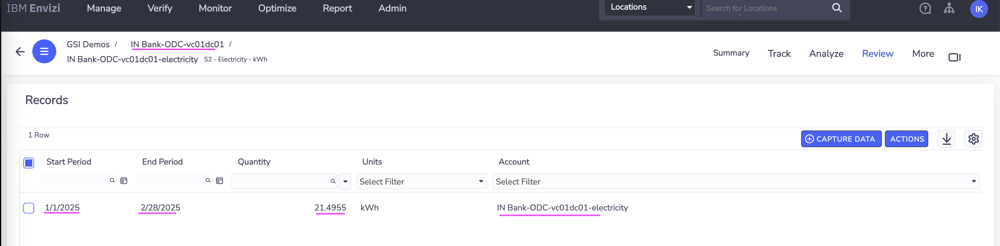

# Integrating Turbo with Envizi via webMethods for Green IT data

In this article, we will learn how to leverage webmethods iPaas integration platform to achieve end-to-end integration between turbonomic and Envizi. The article explains in detail, how to retrieve the data center energy consumption by  using turbonomic api, transform the data into Envizi specific data formats and push it to Envizi data services to further process and load into the Envizi platform to calculate the emissions. 


#### Authors
 [Jeya Gandhi Rajan M](https://community.ibm.com/community/user/envirintel/people/jeya-gandhi-rajan-m1) <br />
 [Madhukrishna Parike]() <br />
 [Jyoti Rani]() <br />
 [Indira Kalagara]()

## Contents

- [1. Prerequisite](#1-Prerequisite)
- [2. Architecture](#2-Architecture)
- [3. Create Workflow in webMethods](#3-Create-Workflow-in-webMethods)
- [4. Execute the Workflow](#4-Execute-the-Workflow)
- [5. Check the result in Envizi](#5-Check-the-result-in-Envizi)
- [6. Schedule Workflow Executionn](#6-Schedule-Workflow-Execution)

## 1. Prerequisite

<details><summary>CLICK me for detailed instructions</summary>

### 1.1 Environment

- Turbonomic v8.14.3 or higher 
- Envizi Saas instance access (Click [here](https://techzone.ibm.com/collection/aiapps-environmental-intelligencewith-envizi/environments) to get access). 
- webMethods SaaS (Click [here](https://signup.softwareag.cloud/#/basic-b) to signup for Trial).

### 1.2 Turbonomic Pre-Configuration

1. Create an user with `Observer` role in Turbonomic. Refer [here](#user-content-1-create-user-in-turbonomoic) to create the user.


### 1.3 Envizi Preconfiguration

#### 1.3.1 Setting up Envizi Organization, Locations and accounts

To start with the integration, first we need to have / configure the organization hierarchy defined in Envizi and configure the identified datacenters as locations. For this article, lets say we have identified two data centers `IBMCloud | vc01dc01` from which we need to collect electricity consumptions and load into Envizi to calcuatle the emissions. So, these two data centers are represented as 2 different locations in the Envizi's organization hierarchy as shown in the below screenshot. 


Each of these data center location in Envizi also have a corresponding electricity account created to store / hold the electricity consumption data. Below are the details of the locations and accounts which will be used as inputs further in the article.


| Location       | Account                   |
| ---------- | ----------------------- | 
| IN Bank-ODC-IBMCloud| IN Bank-ODC-IBMCloud-electricity|
| IN Bank-ODC-vc01dc01| IN Bank-ODC-vc01dc01-electricity|


1. Get the values for the below fields from Envizi. You can get these details by download the `Account Setup and Data Load` template in Envizi specific to locations and account style.

  - Organization (Organization name)
  - Organization Link (Organization reference id)
  - Account Style Link (Reference id for the account style `S2 - Electricity - kWh`)
  - Locations Names and Accounts Names (The locations names under which the accounts to be created)

#### 1.3.2 Envizi S3 Bucket

The integration requires Envizi AWS S3 data service details to place the Envizi templates in the respective s3 folder.  If the Envizi S3 data service is not created, please refer Steps 1 and 2 [here](https://developer.ibm.com/tutorials/awb-sending-udc-excel-to-s3/) to create.

1. From Envizi S3 bucket screen, get the values for the below fields.
  - Bucket
  - Folder
  - Username
  - Access Key
  - Secret Access Key

</details>

## 2. Architecture

Here is the architecture describes about Turbonomic and Envizi integration via webMethods.

Leveraging the capabilities of webMethods iPaas Integration platform, we have created workflows and flow services which will communicate with turbonomic using apis and fetch the statistics related to energy consumptions. By using webmethod flow services the data retrieved through multiple apis can be consolidated and transformed into the Envizi specific data format as csvs and finally placing them into Envizi data servies aws s3 for further processing.


## 3. Create Workflow in webMethods

Let's create workflow in webMethods.

In this workflow, we will invoke Turbonomic APIs to fetch Energy consumption for each DataCenter locations and transform the JSON API response into the CSV template loaded by Envizi.

### 3.1. Create Project

<details><summary>CLICK me for detailed instructions</summary>

1. Login to your instance of webMethods integration with the respective credentials.

2. Click on `+` under the `Projects` tab.


3. Enter the Project name.

4. Click on `Create`, to create the project.


The project gets created as shown in the below image.

</details>

### 3.2. Import Workflow

<details><summary>CLICK me for detailed instructions</summary>

1. Download the Workflow archive file (webMethods workflow.zip) from [here](./files/webMethods-archives).

2. Click on `Import` button.

3. Select the Workflow file that is downloaded in the above step.


4. For the following fields, you can leave the defaults as-is or enter the values as you would like to. 
  - Workflow Name
  - Workflow Description

5. Under `Parameters` section, update the field values based on your turbonomic, envizi environments

Refer the below table for the parameters values.

| Name       | Value                   | Comments             |
| ---------- | ----------------------- | --------------------
| TurboLoginAPI| https://[Turbonomic-URL]/api/v3/login | Turbonomic Login API. Replace the `[Turbonomic-URL]` with your Turbonomic instance url |
| TurboAccount
InAPI| https://[Turbonomic-URL]/api/v3/entities/ | Retrieves the Data Centres statistics such as electricity consumption. Replace the `[Turbonomic-URL]` with your Turbonomic instance url |
| TurboDataCentresAPI|https://[Turbonomic-URL]/api/v3/search|  Fetches the data centres locations from Turbomic instance. Replace the `[Turbonomic-URL]` with your Turbonomic instance url |
| TurboUserName||Enter the Turbonomic UserName received as part of prerequisites|
| TurboPassword | | Enter the Turbonomic Password received as part of prerequisites|
| S3BucketName| | Envizi S3 Bucket name received as part of prerequisites|
| EnviziTemplateFileName |  | Envizi S3 Folder name and File name as as part of prerequisites. Example: client_7e87560fc4e648/Account_Setup_and_Data_Load_DataCenter_electricity.csv|
| 
InFilter| See below | Update startDate and endDate in the 
InFilter and leave the rest as defautls to retrieve the electricity consumption for the period.|
| EnviziDCMap | See below | Create mapping of actual data center name and the corresponding location names created in Envizi along with name of the electricity accounts |

**
InFilter**
```
{
    "data": {
        "startDate": "2024-01-01 00:00:05",
        "endDate": "2024-12-31 23:59:59",
        "statistics": [
            {
                "name": "Energy",
                "filters": [
                    {
                        "type": "relation",
                        "value": "sold"
                    }
                ]
            }
        ]
    }
}
```
**EnviziDCMap**
```
{
  "data":  [
      {
        "turbo_data_center": "IBMCloud",
        "envizi_location": "IN Bank-ODC-IBMCloud",
        "envizi_account": "IN Bank-ODC-IBMCloud-electricity"
      }, 
      {
        "turbo_data_center": "vc01dc01",
        "envizi_location": "IN Bank-ODC-vc01dc01",
        "envizi_account": "IN Bank-ODC-vc01dc01-electricity"
      }
     
    ]
}
```


6. In the above page, click on `+` symbol on the `Connect to Hypertext Transfer Protocol (HTTP)` field. The Add Account popup appears as below.

 


7. In the `URL` field, enter the value `https://[Turbonomic-URL]/api/v3/entities/`
   Replace [Turbonomic-URL] with your Turbonomic instance url 

8. Click `Add` button.

  The project page updated with the above created value.

9. Click on `+` symbol on the `Connect to Amazon Web Services` field. The Add Account popup appears as below.


10. Enter the following values based on the prerequisites values from Envizi.

 - Access Key ID
 - Secret Access Key
 - Default Region  (us-east-1)

11. Click `Add` button.


The project page updated with the above created value.

12. Click `Import` button.


The workflow and the corresponding flow services are created in the integration project as shown below.


</details>

### 3.3. Create Reference Data for Flow service

<details><summary>CLICK me for detailed instructions</summary>

#### 3.3.1 Prepare Envizi Template file.

The Envizi template file to be imported into the workflow as a reference data. Please note that the reference template is based on `Account Setup and Data Load` template for the account style `S2 - Electricity - kWh` Let's prepare that.

1. Download the Reference data file from [here](./files/envizi)

2. Update the file with the values based on the below table. But you may need to update the below columns only based on the prerequisites values from Envizi.
- Organization Link
- Organization
- Account Style Link


|Name                     |  Value               |Comments                  |
|-------------------------|----------------------|--------------------------|
|Organization Link|17000252| The refernce id for the Envizi Organization. Get it from prerequisites|
|Organization|GSI Demos	| The name of the Organization. Get it from prerequisites|
|Location|IBMCloud| The name of location where the account exists/to be created. It will be updated by workflow based on project parameters|
|Location Ref| | Leave it empty|
|Account Style Link|14445| The refernce id for the `S2 - Electricity - kWh` account style. Get it from prerequisites|
|Account Style Caption|S2 - Electricity - kWh| The account style of this account.  It will be updated by workflow based on project parameters|
|Account Subtype|Default| Leave it as it is.|
|Account Number|vc01dc01-electricity| The account name. It will be updated by workflow based on project parameters |
|Account Reference|| Leave it empty|
|Account Supplier|| Leave it empty|
|Account Reader|| Leave it empty|
|Record Start YYYY-MM-DD|2024-01-01| It will be updated by workflow based on project parameters|
|Record End YYYY-MM-DD|2024-12-31| It will be updated by workflow based on project parameters |
|Record Data Quality|Actual| Leave it as it is. |
|Record Billing Type|Standard| Leave it as it is. |
|Record Subtype|Default| Leave it as it is. |
|Record Entry Method|Overwrite| Leave it as it is.|
|Record Reference|| Leave it empty|
|Record Invoice Number|| Leave it empty|
|Total Electricity (kWh)|883.799| Electricity consumption value. It will be updated by workflow based on turbonomic output |
|Green Power (kWh)||Leave it empty |
|Total Cost|| Leave it empty|


#### 3.3.2 Add Reference Data

1. Goto the `Reference Data` data page by clicking on `Configurations -> Flow service -> Reference data`

2. Click on `Add Reference data` button.

  

3. In `Save As` column, enter  the value `EnviziTemplate`

  The `Browse file` button is enabled.

4. Click on `Browse file` button.

5. Choose the above prepared `EnviziTemplate.txt` file

  

  The selected file appear like this.

6. Click on `Next` button.

  

7. Click on `Next` button.

  

8. Click on `Done` button.

  

  The reference data is created as shown below.

  

</details>

### 3.4. View the Workflow & FlowServices 

<details><summary>CLICK me for detailed instructions</summary>

Let's view the imported/created workflow 

1. Click on the `View` button in the `Integrations -> Workflows -> Turbo Envizi Sustainability Solution`.


The workflow page is displayed.

Here is the details about the various nodes.

- **Turbonomic API Login** :  This HTTP node makes an authentication request to turbonomic instance using login API and returns an authentication cookie as part of response header. The subsequent turbonomic APIs uses this cookie as part of their request header by setting `set-cookie`  to authenticate and fetch relavant details.  
- **ParseEnviziDCMap** : This node parses the input json parameter `EnviziDCMap` as json object. 
- **Query JSON** : It Queries specific item from the JSON Object
- **ProcessEnviziDCMap** : It is a flow service `ProcessEnviziDCMap` which parses the josn object `EnviziDCMap` , retrieves the data cetner names and returns the same in string format of "DC1|DC2" 
- **Retrieve Turbo DataCentres** : This HTTP node invokes turbonomic API which returns list of DataCentres with their `uuids`. 
- **DataCentreUUIDs** : This query JSON node retrieves the responseObject JSON data containing the `uuids` from `Retieve Turbo DataCentres` 
- **Parse 
In filter** : This JSON Parse node formats input parameter `
InFilter` as raw JSON data.
- **Query responseObject from 
InFilter** : This query JSON node retrieve JSON data from `Parse 
In filter` node.  
- **Process DataCentre 
In** : It is a flow-service which invokes the turbonomic 
In API to retrieve the electricity consumption and perform the data transformations to return the data in the format as needed by Envizi.
- **Convert JSON to CSV** : This `JSON to CSV` node converts JSON data returned by the flowservice into a CSV file.
- **Upload CSV to S3 Bucket** :  This aws s3 node uploads the CSV file returned by `Convert JSON to CSV`  node into Envizi S3 bucket which will be further processed by Envizi. 


Now, lets view the imported flowservices. 


2. Click on `Integrations -> Flow Services -> DCTest` 

You can expand and explore the flow service transformations implemented

   


</details>
   

## 4. Execute the Workflow

<details><summary>CLICK me for detailed instructions</summary>

1. Click on the `Edit` button in the `Integrations -> Workflows -> Turbo Envizi Sustainability Solution`.


2. Click `ON` (1) to activate the Workflow

3. Click on Run button (2) to start the workflow.
   
 

4. Check the execution logs for the output generated once the flow is executed successfully. 

  This particular flow here is executed to fetch the electricity data from data centers IBMCloud & vc01dc01 data centers which are configured in as locations IN Bank-ODC-IBMCloud , IN Bank-ODC-vc01dc01 respectively between the time period  start date:  2025-01-01, end date : 2025-02-28
  
  Please view the corresponding records in the csv format from the logs in the below screenshot


   

In the next step, verify the same output results reached Envizi and loaded into the system. 

</details>


## 5. Check the result in Envizi

<details><summary>CLICK me for detailed instructions</summary>

#### 5.1. Check the webmethod output csv file in Envizi S3 data service

The webmethods integration workflow should have fetched the data from Turbonomic, transforms into Envizi specific format and pushes the .csv file into Envizi's aws data service S3 folder. 

You can view the status of the file in `Envizi -> Admin -> Data Flow Automation -> File Delivery Status`


#### 5.2. Check the data loaded into respective  electricity accounts of Envizi locations (aka datacenters)





#### 5.3. Sample Data from S3

The sample data received in S3 from Turbonomic is available [here](./files/sample/).
</details>

## 6. Schedule Workflow Execution

The workflow can be scheduled for execution. Follow the steps below to define the schedule for workflow execution.

<details><summary>CLICK me for detailed instructions</summary>

1. Mouse over the `Trigger` node in the workflow 

2. Click on `Settings`


3. Select `Clock` option

4. Click on `Next` button.


5. Change the schedule as per your need 

6. Click on `Done` button

 

The schduling is done and the Trigger node shows the clock icon.

7. Click on `Save` button to save the workflow.

 

Now the workflow will execute automatically as per the defined schedule.

</details>

## Appendix

### 1. Create User in Turbonomoic

Let us create a local user in Turbonomic with the `Observer` role.

<details><summary>CLICK me for detailed instructions</summary>

1. Create a new Local user in Turbonomoic by choosing the below menu option.

`Home > SETTINGS > Local User >  New Local User`


2. User name could be `demo_observer`, give some password and choose role as `Observer`

3. Click `Save` button


4. User is created.


</details>

### 2. Reference

- Sign up for webMethods SaaS Trial https://signup.softwareag.cloud/#/basic-b

- Creating Envizi S3 bucket (Refer Steps 1 and 2 [here](https://developer.ibm.com/tutorials/awb-sending-udc-excel-to-s3/) to create the bucket)

- Getting started with the Turbonomic REST API : https://www.ibm.com/docs/en/tarm/8.13.6?topic=reference-getting-started-turbonomic-rest-api

- IBM Envizi ESG Suite https://www.ibm.com/docs/en/envizi-esg-suite

- Integrate your ESG Data into Envizi using Integration Hub	https://developer.ibm.com/tutorials/awb-envizi-integration-hub/


#### Tags
#envizi
#sustainability
#turbonomic
#webmethods
#esgdata-integration
#integration
#ESG Data and Environmental Intelligence
#sustainability-highlights-home