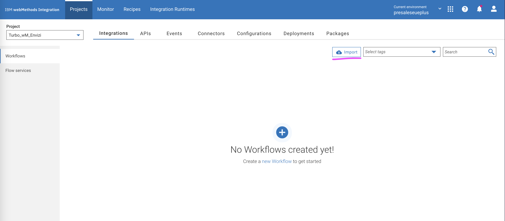

# Integrating Turbo with Envizi via webMethods for Green IT data

This blog explains about the step-by-step instructions to pull green IT data from Turbonomic into Envizi via webMethods Integration.

#### Authors
 [Jeya Gandhi Rajan M](https://community.ibm.com/community/user/envirintel/people/jeya-gandhi-rajan-m1)

## Contents

- [1. Prerequisite](#1-Prerequisite)
- [2. Architecture](#2-Architecture)
- [3. Turbonomic Configuration ](#3-Turbonomic-Configuration)
- [4. Envizi's S3 bucket ](#4-envizis-s3-bucket)
- [6. webMethods Flow Execution Location Feed](#6-webMethods-Flow-Execution-Location-Feed)

## 1. Prerequisite

- Turbonomic v8.14.3 or higher 
- webMethods SaaS or on-prem
- Envizi's S3 bucket 

## 2. Architecture

Here is the architecture  that describes about this Turbo and Envizi integration.

webMethods Integration flow pulls the list of Cloud Regions and On-prem Data Centers from Turbo and sends it to Envizi's S3 bucket in a CSV file. This CSV file will be further processed by the Envizi internally.

## 3. Turbonomic Configuration

### Mandatory Configuration

- Create a user with `Observer` role in Turbo. webMethods needs this user to fetch data from Turbo. 

### Optional Configuration 

- Add the following Tag in vCenter and add their values as tags to the Data Centers for accurate emission calculations from Envizi:
    - `Country`: Name of Country
    - `Latitude`: Latitude in Decimal Degrees format
    - `Longitude`: Longitude in Decimal Degrees format
    

- By default, Envizi will use the Data Center name configured in Turbonomic/vCenter. To change this, Tag Category `EnviziAlternateName` can be added with the desired display name as its value.
- Envizi Locations (Data Centers in this case) need unique display names. If there are any Data Centers with same names, they should be changed from vCenter or Tag Category `EnviziAlternateName` should be added to the Data Center(s) with different name(s)

**Note:** Tags sync from vCenter to Turbonomic might take upto 20 minutes.

## 4. Envizi's S3 bucket 

Envizi product team would have created and shared S3 bucket. This S3 bucket details to be feed into the webMethods flow.

The webMethods flow pulls the data from Turbo and sends it to S3 bucket in a CSV file format. Envizi will further process this CSV file.

## 6. webMethods Flow Execution Location Feed

#### 5.1. Login to webmethods io with username and password

1. Login page.

- URL used `https://presaleseueplus.int-aws-de.webmethods.io/#/`
- Provide the `Username` and `Password`
- click on `Log in` button

#### 5.2. Create a new Project

- Provide `Project Name` and Leave `Source Control - Git server/account` as Default. I have provided the `Project Name` as 'Turbo_wM_Envizi'
- Please name the `Project Name` as per your need.

#### 5.3. Import the Workflows

- Click on the `Import` and select the project location to be imported.

The sample data is available here.  [Accounts](./files/data/accounts/),  [Locations](./files/data/locations/).

#### 5.4. Supply Workflow name, Workflow description, AWS service

- Provide the `Workflow name` as `Sustainability Solution - Locations` and `Workflow description`. Please name the `Workflow name` and `Workflow description` as per your need.
- For the `Connect to Amazon Web Services` configuration details, please click on `+` symbol
- Configure the `Add Account` AWS page with `Account Name`, `Access Key ID`, `Secret Access Key` and `Default Region`.

#### 5.4. Configure the Workflow nodes

- In this step Workflow nodes configuration needs to be updated.

1. Mouse over to `Turbonomic API Login` node and click on the `Settings`

#### 5.5. Activate the Workflow

Toggle ON the workflow to activate

#### 5.6. Run the Workflow

Click on the run the workflow to generate the location feed and push the feed to AWS S3 bucket.

## Reference

Turbonomic - Envizi Integration https://ibm.github.io/IBM-Sustainability-Software-Portfolio-Connectors/turbonomic-envizi/

Turbonomic - Envizi Integration https://github.com/IBM/turbonomic-envizi-appconnect-flows

## Appendix

Refer the following.

#### Achieve Green IT targets by integrating Turbonomic with Envizi

This document covers how Organizations with a sustainability initiative can have an instant impact in their IT Operations by leveraging IBM Turbonomic with Envizi. 

[../01-green-it-turbo-envizi](../01-green-it-turbo-envizi/)

#### Envizi - Turbonomic Performance Dashboard 

This document describes about the Turbonomic Performance Dashboard available in Envizi.

[../03-turbonomic-performance-dashaboard](../03-turbonomic-performance-dashaboard/)

 
#envizi
#Sustainability
#turbonomic

#ESG Data and Environmental Intelligence
#sustainability-highlights-home