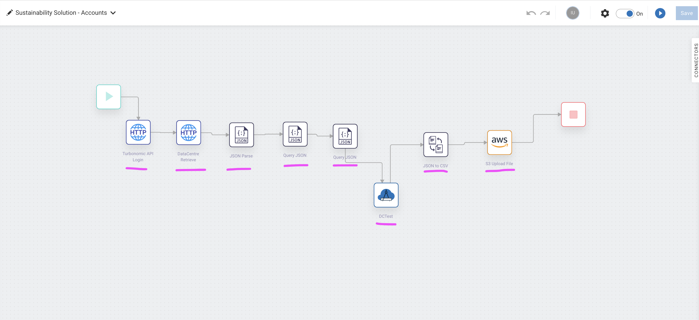
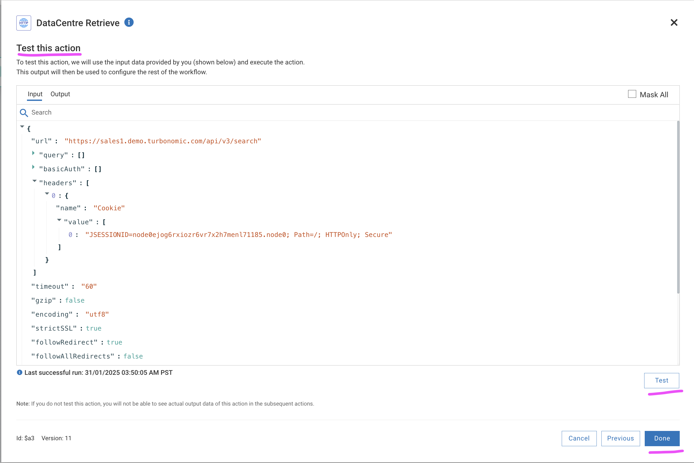

# Integrating Turbo with Envizi via webMethods for Green IT data

This blog explains about the step-by-step instructions to pull green IT data from Turbonomic into Envizi via webMethods Integration.

#### Authors
 [Jeya Gandhi Rajan M](https://community.ibm.com/community/user/envirintel/people/jeya-gandhi-rajan-m1)  
 [Madhukrishna Parike]()  
 [JYOTI RANI]()  
 [INDIRA KALAGARA]()

## Contents

- [1. Prerequisite](#1-Prerequisite)
- [2. Architecture](#2-Architecture)
- [3. webMethods Accounts Workflow Configuration](#3-webMethods-Accounts-Workflow-Configuration)
- [4. Validate Workflow Execution](#4-Validate-Workflow-Execution)
- [5. Schedule Workflow Execution](#5-Schedule-Workflow-Execution)

## 1. Prerequisite

### 1.1 Environment

- Turbonomic v8.14.3 or higher 
- Turbonomic user with `Observer` role in. (Refer [here](#user-content-1-create-user-in-turbonomoic) to create the user)
- Envizi's S3 bucket (Refer Steps 1 and 2 [here](https://developer.ibm.com/tutorials/awb-sending-udc-excel-to-s3/) to create the bucket). Make a note of the values of the `Bucket`, `Folder`, `UserName`, `Access Key` and `Secret Access Key` for further reference.
- webMethods SaaS (Click [here](https://signup.softwareag.cloud/#/basic-b) to signup for Trial).

### 1.1 Envizi Organization hierarchy details
 -  Following the steps in this article, we would be retreiving the energy consumption (electricity) data of the Datacenter using the Turbo APIs.
 -  To proceed with the actually integration, we need to have the data center location and the relevant accounts ( to hold the electricity data)  to be pre-configured in Envizi.  Hence, in this article, we are using the below organization hierarchy in Envizi and the corresponding data center locations ex: IN Bank - IBMC-WDC07-Ashburn VA , etc and the specific accounts of the data center IN Bank - IBMC-WDC07-Electricity. 

 -  Feel free to use your own hierarchy, location and account names and make sure to update the same in the configurations below whereever required. 
  

## 2. Architecture

Here is the architecture  that describes about this Turbo and Envizi integration via webMethods.

webMethods Integration flow pulls the list of Cloud Regions and On-prem Data Centers from Turbo and sends it to Envizi's S3 bucket in a CSV file. This CSV file will be further processed by the Envizi internally.

## 3. webMethods Accounts Workflow Configuration

In this workflow, we will invoke Turbonomic APIs to fetch Energy consumption for each DataCenter locations and transform the JSON API response into the CSV template loaded by Envizi.

CLICK me for detailed instructions

### 3.1. Login to webMethods Integration

- Login to your instance of webMethods integration with the respective credentials.

### 3.2. Create a new Project

- Name Project Name as `Turbo_wM_Envizi` and Leave `Source Control - Git server/account` as Default. Note choose the project name as you desired.

### 3.3. Import the Workflows

- Download the Workflow archive file here [Accounts](./files/webMethods-archives/Accounts).
- Click on the `Import` and select the Workflow location that is downloaded in the above step.

### 3.4. Provide Workflow name, Workflow description, AWS service

- Provide the `Workflow name` as `Sustainability Solution - Accounts` and `Workflow description`. Please name `Workflow name` and `Workflow description` as per your need.
- Parameters custom `key-value pairs` used inside the Workflow.
#### Parameters
| Name       | Value                   | Comments             |
| ---------- | ----------------------- | --------------------
| TurboLoginAPI| https://[TurbonomicInstance-URL]/api/v3/login | Turbonomic Login API|
| TurboAccountStatsAPI| https://[TurbonomicInstance-URL]/api/v3/entities/ | Retrieves the Data Centres statistics such as electricity consumption|
| TurboUserName|changeme|Replace the `changeme` username created in 2nd bullet point under 1.1 step|
| S3BucketName| | S3 Bucket name as per your Envizi instance|
| EnviziTemplateFileName |  | S3 Folder name and File name as per Envizi instance. Example: client_7e87560fc4e648/Account_Setup_and_Data_Load_IBMCloud_electricity.csv|
| TurboDataCentresAPI|https://[TurbonomicInstance-URL]/api/v3/search|  Fetches the data centres locations from Turbomic instance.|
| statsFilter| {"data":{ "startDate":"2024-01-01 00:00:05", "endDate": "2024-12-31 23:59:59","statistics": [ { "name": "Energy", "filters": [ { "type": "relation", "value": "sold" }]}]}}| Please update statDate and endDate to retrieve the electricity consumption for the period.|
| DCNames | "IBMCloud" | Engizi provides the Data Centre names to be retrieved. More data centres can be added with `&#124;` symbol for example: "IBMCLoud&#124;Vc01dc01" |
| TurboPassword | changeme| Replace the `changeme` password created in 2nd bullet point under 1.1 step|

- For the `Connect to Hypertext Transfer Protocol (HTTP)` configuration details, please click on `+` symbol and provide URL as `https://[TurbonomicInstance-URL]/api/v3/entities/stats` under `URL`. Leave other fields as it is.
- For the `Connect to Amazon Web Services` configuration details, please click on `+` symbol
- Configure the `Add Account` AWS page with `Account Name`, `Access Key ID`, `Secret Access Key` and `Default Region`. Leave other fields as it is.
- Click on `Import` button

#### Add Reference Data
- Reference data is a file which is a Envizi template expects as a final output.  Please download the Reference data [ReferenceData](./files/webMethods-archives/Reference/) which needs to be added after importing the Workflow in a project.
- Under the project created in step 3.2, Click on `Configurations -> Flow service -> Reference data -> Add Reference Data`
- `Save As` EnviziTemplate and `Reference Data File` Browse file and select the `EnviziTemplate.txt` and Click on `Next`, `Next` and `Done`

- Click on `Edit` by moving mouse over the Workflow imported above.

### 3.5. Configure the Workflow nodes

- In this step Workflow nodes configuration needs to be updated.

#### 3.5.1. Configure the node `Turbonomic API Login`

- Configurations for all the nodes are already available when the Workflow is imported, However each node needs to be tested.

- Mouse over to `Turbonomic API Login` node and click on `Settings`
- Click on `Next`
- In the `Action configure`, Click on `Next`

#### Test this action

- Click on `Test` button to see if the login is successful and Click on `Done` button once it is success.

#### 3.5.2. Configure the node `DataCentre Retrieve`

- Mouse over to `DataCentre Retrieve` node and click on `Settings`
- Click on `Next`
- In the `Action configure`, page Click on `Next`

#### Test this action

- Click on `Test` button to see if the DataCentre Retrieval is successful and Click on `Done` button once it is success.

#### 3.5.3. Configure the node `JSON Parse`

- Mouse over to `JSON Parse` node and click on `Settings`
- Click on `Next`
- In the `Action configure` page CLick on `Next`

#### Test this action

- Click on `Test` button to see if the `JSON Parse` is successful and Click on `Done` button once it is success.

#### 3.5.4. Configure the node `Query JSON`

- Mouse over to `Query JSON` node and click on `Settings`
- Click on `Next`
- In the `Action configure` page click on `Next`

#### Test this action

 Click on `Test` button to see if the `Query JSON` is successful and Click on `Done` button once it is success.

#### 3.5.5. Configure the node `Query JSON`

- Mouse over to `Query JSON` node and click on `Settings`
- Click on `Next`
- In the `Action configure` page click on `Next`

#### Test this action

 Click on `Test` button to see if the `JSON to CSV` is successful and Click on `Done` button once it is success.

 

 #### 3.5.6. Configure the node `DCTest`

 - Mouse over to `DCTest` node and Click on `Settings`
- Click on `Next`
- In the `Action configure` page click on `Next`

#### Test this action

 Click on `Test` button to see if the `DCTest` is successful and Click on `Done` button once it is success.

 

 #### 3.5.7. Configure the node `JSON to CSV`

- Mouse over to `JSON to CSV` node and Click on `Settings`
- Click on `Next`
- In the `Action configure` page click on `Next`

#### Test this action

 Click on `Test` button to see if the `JSON to CSV` is successful and Click on `Done` button once it is success.

 

 #### 3.5.8. Configure the node `S3 Upload File`

- Mouse over to `S3 Upload File` node and Click on `Settings`
- Click on `Next`
- In the `Action configure` page click on `Next`

#### Test this action

- Click on `Test` button to see if the `S3 Upload File` is successful and Click on `Done` button once it is success.

### 3.6. Activate the Workflow

- Toggle `ON` to activate the Workflow

### 3.7. Run the Workflow

- Run the Workflow to push the DataCentre electricity consumption stats to Envizi

## 4. Validate Workflow Execution

CLICK me for detailed instructions

#### 4.1. Data in S3

- The flows will pull the data from the Turbo and push it to S3. You can see the Data flow status in S3 like this.

#### 4.2. Sample Data from S3

- The sample data is available here.  [Accounts](./files/data/accounts/),  [Locations](./files/data/locations/).

#### 4.3. Processing S3 files in Envizi

- Envizi automatically pull the data from S3 and process it. The accounts and account summary page looks like this now.

## 5. Schedule Workflow Execution

Locations and Accounts workflow can be scheduled for execution. Follow the steps below to define the schedule for workflow execution.

CLICK me for detailed instructions

- Mouse over the `Trigger` node in the workflow and click on `Settings`

- From the Trigger window, search and select `Clock` and `Next`

- Change the settings to define the schedule for flow execution and click `Done`

- Save the workflow and it will execute automatically as per the defined schedule.

## Appendix

### 1. Create User in Turbonomoic

Let us create a local user in Turbonomic with the `Observer` role.

CLICK me for detailed instructions

1. Create a new Local user in Turbonomoic by choosing the below menu option.

`Home > SETTINGS > Local User >  New Local User`

2. User name could be `demo_observer`, give some password and choose role as `Observer`

3. Click `Save` button

4. User gets created.

### 2. Reference

- Turbonomic - Envizi Integration https://ibm.github.io/IBM-Sustainability-Software-Portfolio-Connectors/turbonomic-envizi/

- Turbonomic - Envizi Integration https://github.com/IBM/turbonomic-envizi-appconnect-flows

- Creating Envizi S3 bucket (Refer Steps 1 and 2 [here](https://developer.ibm.com/tutorials/awb-sending-udc-excel-to-s3/) to create the bucket)

- Getting started with the Turbonomic REST API : https://www.ibm.com/docs/en/tarm/8.13.6?topic=reference-getting-started-turbonomic-rest-api

- IBM Envizi ESG Suite https://www.ibm.com/docs/en/envizi-esg-suite

- Integrate your ESG Data into Envizi using Integration Hub	https://developer.ibm.com/tutorials/awb-envizi-integration-hub/

- Sign up for webMethods SaaS Trial https://signup.softwareag.cloud/#/basic-b

#### Tags
#envizi
#Sustainability
#turbonomic

#ESG Data and Environmental Intelligence
#sustainability-highlights-home